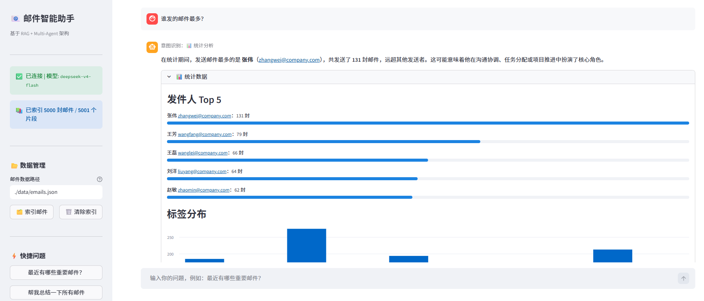
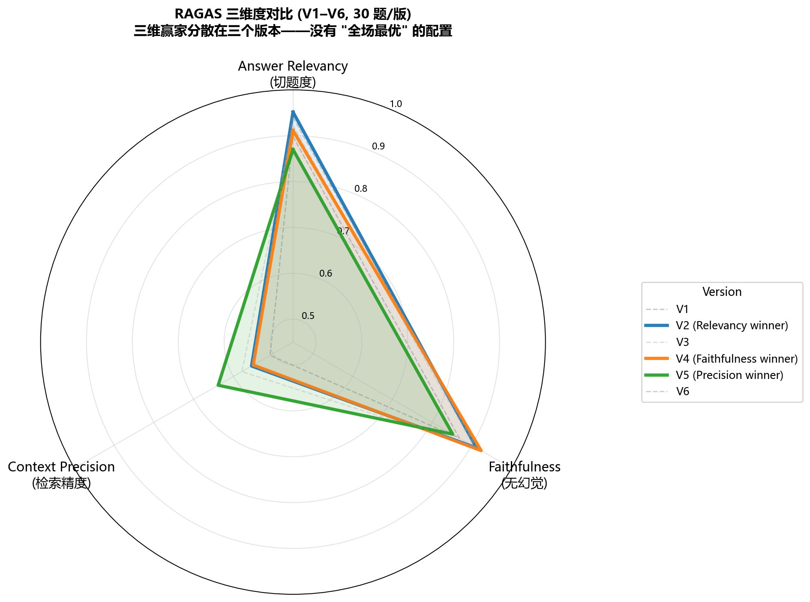
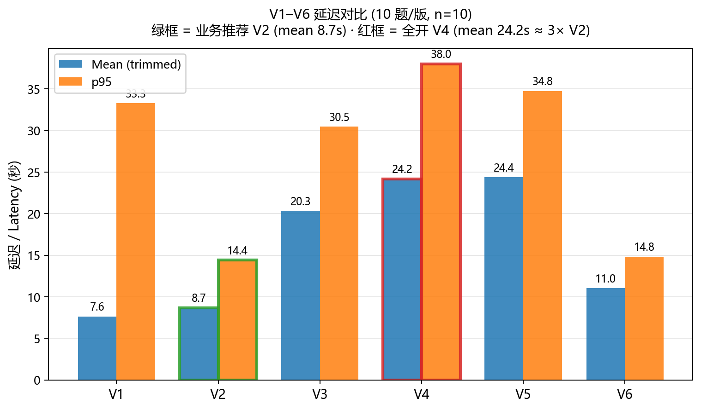

# Email RAG Agent

> **Author**: 赵伟鑫 (Yoimiya2627) — AI 应用工程师 / 大模型应用开发工程师
> **Contact**: a1486807398@163.com | [GitHub](https://github.com/Yoimiya2627)

一个基于检索增强生成（RAG）和多 Agent 架构的邮件智能问答系统。

做这个项目的初衷是想把"RAG 链路里每一层（向量检索 / BM25 / RRF 融合 / LLM 重排 / Query Rewrite）到底各自贡献多少"这件事真正搞清楚——所以从一开始就把所有组件做成可开关的特性，配套写了消融评测脚本去量化它们。

## 目录

- [30 秒速览](#30-秒速览)
- [Demo](#demo)
- [它能做什么](#它能做什么)
- [快速开始](#快速开始)
- [配置说明](#配置说明)
- [系统架构](#系统架构)
- [技术栈](#技术栈)
- [评测](#评测)
- [工程问题复盘](#工程问题复盘)
- [测试](#测试)
- [已知限制](#已知限制)
- [后续扩展方向](#后续扩展方向)
- [API 端点](#api-端点)
- [目录结构](#目录结构)
- [其他启动方式](#其他启动方式)
- [开发笔记](#开发笔记)

## 30 秒速览

- **Function-calling Agent**：ReAct 式工具调用循环，规划模型自主多轮调用 5 个工具完成多步任务，带 max-steps / 死循环检测 / 工具报错回灌等护栏 → [`docs/architecture.md`](docs/architecture.md) §10
- **多 Agent 路由**：5 种意图（查 / 汇总 / 写信 / 统计 / 兜底），LLM 分类 + 异常降级
- **混合检索 + RRF 融合**：向量（bge-m3）+ BM25 双路并行，绕开分数量纲冲突
- **Self-RAG 反思**：LangGraph 状态机，全不相关时改写 query 重试（最多 2 次）
- **SSE 真流式**：worker 线程 + asyncio.Queue 桥接同步 SDK 与异步框架
- **6 版 RAGAS 消融**：三维度赢家分散在 V2/V4/V5，按业务目标选 BM25+RRF 方案 → [`docs/evaluation.md`](docs/evaluation.md)
- **5 个工程问题复盘**：max_tokens / SSE 假流式 / BM25 缓存 / 熔断器跨版本污染 / RAGAS 反直觉 → [`docs/technical_retrospective.md`](docs/technical_retrospective.md)

## Demo

[](docs/demo.mp4)

> 约 1 分 40 秒：邮件检索 / 预算相关查询 / 统计分析 / 切到 evaluation 表格。点击预览图打开 MP4（约 17 MB）。

## 它能做什么

- **Agent 多步任务**："找一封关于预算评审的邮件，帮我起草确认参会的回复" → agent 自主规划、多轮调用工具（检索 → 取详情 → 起草）完成
- **检索式问答**："Q3 预算评审会议是谁发的？" → 从 5000 封邮件里找出相关邮件回答
- **批量摘要**："这周项目进展整理一下" → 多封相关邮件综合摘要
- **回信草稿**："帮我回 Bob 那封询价邮件" → 起草回复
- **统计分析**："本月每个发件人发了多少封？" → 聚合元数据回答
- **多轮对话**：每个 session 独立记忆，5 轮滑窗（10 条消息）
- **流式输出**：SSE 真流式（不是攒齐再放）

## 快速开始

### macOS / Linux

```bash
cp .env.example .env       # 编辑 .env，填 DEEPSEEK_API_KEY
make install               # pip install + 预下载 bge-m3（首次约 5 分钟，~570MB）
make index                 # 索引 data/emails.json 进 ChromaDB（约 2 分钟）
make run                   # 启 FastAPI :8000 + Streamlit :8501（Ctrl-C 同时停）
```

打开 http://localhost:8501 试用，API 文档在 http://localhost:8000/docs。

### Windows（PowerShell）

如果首次执行被 ExecutionPolicy 拦，在当前会话临时放开：`Set-ExecutionPolicy -Scope Process -ExecutionPolicy Bypass`。

```powershell
copy .env.example .env     # 编辑 .env，填 DEEPSEEK_API_KEY
.\tasks.ps1 install
.\tasks.ps1 index
.\tasks.ps1 run
```

看所有命令：`make help` 或 `.\tasks.ps1 help`。
其他启动方式（单独起 API/UI、Docker、跑全量评测）见 [其他启动方式](#其他启动方式)。

## 配置说明

唯一**必填**的环境变量是 `DEEPSEEK_API_KEY`，其它都有合理默认值。完整字段见 [`.env.example`](.env.example)。

**核心可选配置**：

| 配置 | 默认 | 说明 |
|------|------|------|
| `DEEPSEEK_MODEL` | `deepseek-v4-flash` | 推理模型，重排和打分质量更稳；改成 `deepseek-chat` 可换非推理模型省 token |
| `EMBEDDING_MODEL` | `BAAI/bge-m3` | 本地嵌入模型，首次运行自动下载约 570MB |
| `EMBEDDING_DEVICE` | `cpu` | 有 GPU 改 `cuda` 提速 |
| `CHROMA_PERSIST_DIR` | `./chroma_db` | 向量库本地目录 |
| `TOP_K` / `RERANK_TOP_N` | `5` / `3` | 检索召回数 / 重排后保留数 |
| `LLM_TIMEOUT` | `60` | LLM 单次调用超时（秒） |
| `AGENT_PLANNER_MODEL` | `deepseek-chat` | Agent 规划/选工具用的模型（非推理，更快） |
| `AGENT_MAX_STEPS` | `6` | Agent 单任务最多工具调用轮数 |
| `AGENT_MAX_TOKENS` | `4000` | Agent 最终答案的输出 token 上限（防多步长答案被截断） |

**Feature flags**（默认 = V2：`BM25=true, RRF=true, RERANKER=false, REWRITE=false`，业务推荐配置；4 个 flag 全关即等价 V1 纯向量基线）：

| Flag | 默认 | 说明 |
|------|:----:|------|
| `ENABLE_BM25` | ✅ | 关闭后退回纯向量检索 |
| `ENABLE_RRF` | ✅ | 关闭后 BM25 仍跑但用简单加权融合（不再用 RRF） |
| `ENABLE_RERANKER` | ❌ | 开启后引入 LLM 重排，mean 延迟 +~12s（V2→V3） |
| `ENABLE_QUERY_REWRITE` | ❌ | 开启后多一次 LLM 调用做 query 改写 |

> 想跑全开 V4 配置（关心 faithfulness 且能接受高延迟的合规场景）把 `RERANKER` 和 `REWRITE` 都改成 `true` 即可。

各 flag 对三维度指标和延迟的具体影响见 [`docs/evaluation.md`](docs/evaluation.md)。

## 系统架构

完整的架构图、时序图、状态机详见 [`docs/architecture.md`](docs/architecture.md)，覆盖离线索引、在线问答、混合检索 + RRF、Self-RAG 状态机、SSE 线程桥接、降级策略等。

简化版本：

```
                  ┌──────────────────────────────────────────────┐
   用户 query  →  │  Coordinator（LLM 意图分类）                 │
                  └─────┬─────────┬──────────┬─────────┬─────────┘
                        │         │          │         │
                  RetrieverAgent  Summarizer  Writer   Analyzer
                        │         │          │         │
                        └────┬────┴──────────┘         │
                             ↓                          │
              ┌──────────────────────────┐              │
              │ Query Rewrite (LLM)      │              │
              │ Hybrid Search:           │              │
              │   Vector (bge-m3)        │              │
              │ ⊕ BM25 (rank_bm25)       │              │
              │   → RRF 融合             │              │
              │ → 后过滤 (sender/date)   │              │
              │ → LLM Rerank (熔断器)    │              │
              │ → DeepSeek Generate      │              │
              └──────────────────────────┘              │
                             ↓                          ↓
                          Answer ←── 元数据聚合（发件人 Top / 日期分布）
```

另有一条 Self-RAG 链路（`POST /chat/graph`），用 LangGraph 实现状态机，在生成前加一步"LLM 判断检索结果是否真的相关"，不相关就改写 query 重试（最多 2 次）。

## 技术栈

| 层 | 选择 | 理由 |
|---|---|---|
| 嵌入 | `BAAI/bge-m3`（本地） | 中文好、8192 token 长上下文、零 API 成本 |
| 向量库 | ChromaDB（本地持久化） | 开发期零运维、迁移到 Milvus/Qdrant 改一个文件即可 |
| 关键词检索 | `rank_bm25` + RRF 融合 | RRF 不依赖分数量纲（BM25 无界 vs 余弦 0~1） |
| LLM | DeepSeek `deepseek-v4-flash` | 推理模型，重排和打分质量更稳 |
| 工作流 | LangGraph 1.x | Self-RAG 状态机，支持条件边和循环重试 |
| API | FastAPI + SSE | 流式 token 实时推送 |
| 前端 | Streamlit | 快速搭 chat UI，能切换流式/Self-RAG/普通三种模式 |
| 备选实现 | LangChain | 平行写了一版 `langchain_version/`，验证手写链路和框架版的一致性 |

## 评测

`scripts/run_ragas_eval.py` 实现了 6 个版本的消融对比：

| 版本 | BM25 | RRF | Reranker | Query Rewrite |
|------|------|-----|----------|---------------|
| V1   | ❌   | ❌  | ❌       | ❌            |
| V2   | ✅   | ✅  | ❌       | ❌            |
| V3   | ✅   | ✅  | ✅       | ❌            |
| V4   | ✅   | ✅  | ✅       | ✅            |
| V5   | ✅   | ❌  | ✅       | ✅            |
| V6   | ✅   | ✅  | ❌       | ✅            |

三维度指标（每条都用 LLM 打分，0~1）：
- `answer_relevancy`：答案与问题切题度
- `faithfulness`：答案是否有上下文依据（不编）
- `context_precision`：检索片段中真正有用的比例

跑法：

```bash
python scripts/run_ragas_eval.py                                # 默认每版抽 30 题
python scripts/run_ragas_eval.py --versions V2,V4 --limit 100   # 完整测试集
```

输出 `data/eval_results/comparison.json` + 终端对比表。

### 实测结果（5000 封语料 / 100 题测试集，每版抽 30 题）





| Version | BM25 | RRF | Rerank | Rewrite | Relevancy | Faithful | Precision |
|---------|:----:|:---:|:------:|:-------:|----------:|---------:|----------:|
| V1 纯向量 | ❌ | ❌ | ❌ | ❌ | 0.8667 | **0.9233** | 0.5937 |
| V2 +BM25+RRF | ✅ | ✅ | ❌ | ❌ | 0.9567 | 0.9000 | 0.5713 |
| V3 +Reranker | ✅ | ✅ | ✅ | ❌ | 0.9333 | 0.9017 | **0.7147** |
| V4 全开 | ✅ | ✅ | ✅ | ✅ | 0.9533 | 0.8783 | 0.6427 |
| V5 V4-RRF | ✅ | ❌ | ✅ | ✅ | 0.9467 | 0.9083 | 0.6147 |
| V6 V4-Reranker | ✅ | ✅ | ❌ | ✅ | **0.9600** | 0.8967 | 0.6050 |

> 图表用 `python scripts/generate_charts.py` 重新生成，数据源是 `data/eval_results/comparison.json` + `latency.json`。

**一个稳健发现，一个方法论提醒：**

1. **没有"全场最优"的配置**：三个指标各自的最优版本都不一样——relevancy 最高 V6、faithfulness 最高 V1（纯向量基线）、precision 最高 V3。组件之间是 trade-off，不是单调叠加。这套消融跑过两次，两次都出现"三个指标被三个不同配置瓜分"——但**具体哪个配置赢哪个指标并不稳定**。所以这里下的结论是这个**模式**（不存在通吃的配置），不是精确排名。
2. **n=30 + LLM 打分有不可忽略的方差**：上表是单次、每版 30 题、LLM 当裁判的结果，重跑会波动。这些数字应被当作**有噪声的估计**——4 位小数不代表 4 位精度。要更稳的结论需加大题量（→100）或多次取平均。

**方向性观察**（趋势可信，精确数值不必较真，完整方法见 [`docs/evaluation.md`](docs/evaluation.md)）：

- **LLM Reranker 提精度、降切题度**：V2→V3 加 reranker，context_precision 明显上升（剔掉噪声片段），代价是 answer_relevancy 略降。建议进一步替换为 cross-encoder（如 `bge-reranker-v2-m3`）——LLM 当 reranker 收益不稳定，且 V2→V3 mean 延迟增加约 12s，cross-encoder 预计可压到毫秒级。
- **Query Rewrite 是双刃剑**：在这套规整的合成数据上，加 rewrite 对三指标互有增减、整体不构成明显增益——合成数据口语化程度低，rewrite 收益有限；真实数据口语化更重，ROI 预计不同。

**业务选型**：邮件查询场景关心 relevancy + 低延迟——最终选 **V2（向量+BM25+RRF）**：relevancy 处于第一梯队（与最高的 V6 基本持平），且不带 reranker / rewrite，**延迟最低**（mean 8.7s，约为全开 V4 的 1/3）。组件不是越多越好，按业务目标和延迟要求选方案。

### Agent 级评测

RAGAS 评测的是检索质量；`scripts/run_agent_eval.py` 评测 **agent 本身**——在一个多步任务测试集上量化任务成功率、工具调用准确率（实际用的工具是否覆盖预期）、平均步数。这衡量"agent 有没有选对工具、有没有真的完成任务"，和检索三维度是正交的。结果输出到 `data/eval_results/agent_eval.json`。

```bash
python scripts/run_agent_eval.py
```

## 工程问题复盘

5 个工程问题完整复盘（按 现象 → 排查 → 根因 → 修复 → 教训 结构）见 [`docs/technical_retrospective.md`](docs/technical_retrospective.md)；更多调试记录与待办识别见 [`docs/engineering_pitfalls.md`](docs/engineering_pitfalls.md)。这里列出最有代表性的几个：

1. **推理模型 `max_tokens` 陷阱**：`deepseek-v4-flash` 的 `max_tokens` 同时覆盖 `reasoning_content` 和 `content`。原代码各处写的是 128~256，结果推理过程吃光预算后 `content` 永远是空字符串——6 处 LLM 调用（RAGAS 打分 / query rewrite / 过滤抽取 / reranker / 意图分类 / Self-RAG grade）全部受影响。修复后普通调用 bump 到 1500、高推理量调用 3000，并加 `reasoning_content` 兜底解析。

2. **SSE 假流式**：`/chat/stream` 端点用 `list(stream_generate(...))` 把所有 token 收完才 yield，等于伪装的非流式。改成 `asyncio.Queue` + 工作线程 `call_soon_threadsafe` 桥接才是真流式。

3. **BM25 每次查询都重建索引**：5000 文档单次 800ms+。加了 `(chunk_count, BM25Okapi, ...)` 三元组缓存 + 用 `collection.count()` 做 cheap probe 检测漂移，命中后 22ms（40× 提升）。

4. **消融实验里 reranker 熔断器状态泄漏**：模块全局变量 `_consecutive_failures` 被 V1~V6 共用，V3 偶发失败会永久关闭后续版本的 reranker。加 `reset_circuit_breaker()` 在每个版本开始前清零。

5. **多线程 session 状态丢失**：`defaultdict(ConversationMemory)` 的 get-or-create 不是原子操作，并发首次访问同一 session 会互相覆盖。换成显式 lock + helper。

## 测试

`tests/` 下 5 个文件、45 个用例覆盖关键模块：

- `test_chunker.py`：段落切分、强制切分的 overlap 边界、`min_chunk_size` 合并、空文本处理。
- `test_retriever.py`：`ENABLE_BM25` / `ENABLE_RRF` flag 分支、RRF 融合分数计算、BM25 缓存命中与按 `collection.count()` 漂移失效。
- `test_memory.py`：滑动窗口裁剪、session 隔离、8 线程并发 `add` 不丢消息。
- `test_coordinator.py`：意图分类正常路径、`reasoning_content` 兜底、JSON 损坏 / LLM 异常 / 未知 intent 全部回退到 `GENERAL`、`route()` GENERAL fallback 路由到 `RetrieverAgent`。
- `test_eval.py`：LLM 打分降级到向量打分的两级 fallback、版本 flag 切换、消融跑跨版本 `reset_circuit_breaker()` 调用次数。

全部用 mock，不调用真实 LLM、不读 ChromaDB。运行：

```bash
make test                    # macOS / Linux
.\tasks.ps1 test             # Windows
python -m pytest tests/ -v   # 任意平台
```

## 已知限制

- 单进程方案：`_sessions` 是进程内 dict，多 worker 部署需要换 Redis
- 检索 pipeline 在三处重复实现（RetrieverAgent / graph_workflow / run_ragas_eval），值得抽到 `core/pipeline.py`
- 5000 邮件下 in-memory BM25 仍可接受，10 万级先压测，百万级或复杂过滤/检索需要换 Elasticsearch

## 后续扩展方向

在邮件场景基础上，逐步抽象可复用的 RAG / Agent / SSE / Memory / Evaluation 能力，计划扩展到客服 FAQ 检索、工单摘要、意图分流等场景。

## API 端点

| 方法 | 路径 | 说明 |
|------|------|------|
| GET  | `/health` | 健康检查 |
| POST | `/index` | 索引邮件 |
| POST | `/index/clear` | 清空索引 |
| GET  | `/index/status` | 已索引数量 |
| POST | `/chat` | 多 Agent 问答（含意图分类） |
| POST | `/chat/stream` | SSE 流式问答 |
| POST | `/chat/graph` | Self-RAG 工作流（LangGraph） |
| POST | `/chat/agent` | Function-calling Agent（自主多步工具调用） |
| DELETE | `/chat/history` | 清除指定 session 记忆 |
| POST | `/query` | 直连 RAG（不走意图路由） |

请求体（除 `/index` 外）通用：

```json
{
  "query": "最近有哪些重要邮件？",
  "session_id": "user-001"
}
```

## 目录结构

```
.
├── api/main.py                # FastAPI 入口
├── frontend/app.py            # Streamlit
├── agents/                    # Coordinator + 4 专家 agent + LangGraph + agent loop/tools
├── core/                      # loader/cleaner/chunker/embedder/retriever/pipeline/reranker/generator/memory
├── config/settings.py         # 配置 + .env
├── models/schemas.py          # Pydantic schemas
├── scripts/                   # 数据生成 + RAGAS 评测 + 调试 probe
├── langchain_version/         # LangChain 平行实现
├── data/                      # emails.json + ragas_testset.json + eval_results/
├── chroma_db/                 # runtime 生成，已 gitignore
├── docs/
│   ├── architecture.md             # 架构图与流程详解
│   ├── evaluation.md               # RAGAS 6 版评测 + 业务选型
│   ├── technical_retrospective.md  # 5 个工程问题复盘
│   └── engineering_pitfalls.md     # 完整问题清单 + 调试方法论
├── Makefile + tasks.ps1       # 一键启动（macOS/Linux + Windows）
├── Dockerfile + docker-compose.yml
└── requirements.txt
```

## 其他启动方式

### 单独起 API 或前端

调试时常常只想起一个服务：

| 用途 | macOS / Linux | Windows |
|------|---------------|---------|
| 只起 API | `make api` | `.\tasks.ps1 api` |
| 只起 Streamlit | `make ui` | `.\tasks.ps1 ui` |
| 跑全 6 版评测（~30 分钟） | `make eval-all` | `.\tasks.ps1 eval-all` |
| 测延迟 | `make latency` | `.\tasks.ps1 latency` |
| 清 chroma_db + __pycache__ | `make clean` | `.\tasks.ps1 clean` |

### Docker

不想本地装 Python 也可以走 docker-compose：

```bash
cp .env.example .env
docker-compose up --build
```

启动后 API 在 :8000、前端在 :8501。首次启动会下嵌入模型（约 570MB），与本地启动一致。

## 开发笔记

- 每个新功能都加了 `ENABLE_XXX` 开关，方便消融实验切换
- 所有 LLM 调用都带超时（默认 15s）+ 三段降级（重试 → 回退到无 LLM 的合理默认 → 友好提示）
- 旧实现保留为降级路径，不轻易直接删除——这次几次重大重构（SSE / LangGraph / BM25 缓存）都遵守这个规则
- `.env` 在 `.gitignore` 里；密钥不入库
