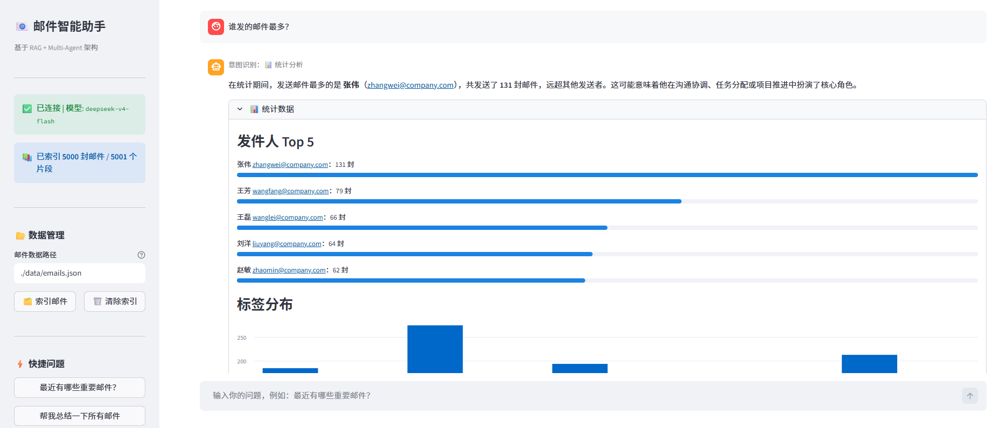

# Email RAG Agent

> **Author**: 赵伟鑫 (Yoimiya2627) — Agent 开发工程师 / 大模型应用开发工程师
> **Contact**: a1486807398@163.com | [GitHub](https://github.com/Yoimiya2627)

一个面向邮件场景的 Agentic RAG 系统。底层是向量检索 + BM25 + RRF + 可选 Cross-Encoder reranker 的混合检索 RAG；上层是 DeepSeek 原生 function calling 的 ReAct-style agent loop；工具层已经升级为 MCP-ready backend，支持 FastMCP tools/resources/prompts、可选 MCP 鉴权、工具级权限策略、审计查询、人审审批、Gmail draft-only provider、Gmail read-only 增量同步和 EvalOps trace/report/gate。

这个项目的重点不是“调一个 LLM API”，而是把邮件 RAG 能力做成可编排、可评测、可回归、可审计的 Agent 工程系统。

## 目录

- [核心亮点](#核心亮点)
- [Demo](#demo)
- [功能能力](#功能能力)
- [快速开始](#快速开始)
- [配置说明](#配置说明)
- [系统架构](#系统架构)
- [Agent 工具层](#agent-工具层)
- [MCP Server](#mcp-server)
- [Human-in-the-loop](#human-in-the-loop)
- [Gmail Read-only Sync](#gmail-read-only-sync)
- [Trace 与 Eval](#trace-与-eval)
- [评测结果](#评测结果)
- [测试](#测试)
- [API 端点](#api-端点)
- [目录结构](#目录结构)
- [已知限制和下一步](#已知限制和下一步)

## 核心亮点

- **Function-calling Agent Loop**：`/chat/agent` 使用 DeepSeek 原生 tool calls，多轮执行 `plan -> tool_call -> observe -> re-plan`。
- **Agent Skill Profiles**：`agents/skills.py` 在工具层之上增加任务型 Skill，按 `mail_search`、`reply_drafting`、`mail_digest` 等场景收敛可见工具和 planner 指令。
- **MCP-ready Tool Backend**：工具定义集中在 `agents/tool_registry.py`，同源派生本地 function schema 和 FastMCP 注册。
- **MCP 生产化基础**：MCP client 支持 bearer token header；server 可启用 token verifier；工具调用写 JSONL 审计；MCP tools/list 有 schema cache；MCP server 支持 allowed-tools 和 read-only 工具可见性策略。
- **Human-in-the-loop 安全链路**：高风险 `send_email` 只创建 pending approval；审批通过后默认 simulated，配置 `MAIL_PROVIDER=gmail` 时只创建 Gmail draft，不直接发送。
- **真实邮箱 read-only 接入**：Gmail read-only provider 使用独立只读 OAuth scope，把真实邮件增量同步到本地忽略 JSON，再复用清洗、切分、embedding 索引链路。
- **Agent EvalOps**：105 条 agent 任务集覆盖多步、异常、歧义、权限、高风险发信和 Gmail draft；2026-06-11 已完成 full LLM run 并通过 strict gate（task_success_rate `0.8095`、tool_accuracy `0.8857`、forbidden `0.0000`、max_steps `0.0190`）。
- **RAG 消融评测**：7 版 RAGAS-style 对比，量化 BM25、RRF、LLM reranker、Cross-Encoder reranker、query rewrite 的 ROI；新增 synthetic gold chunk baseline 和 `context_recall` 确定性评测，V7 在 30 题 synthetic gold 上达到 `mean_context_recall=0.8000`，真实 Gmail 100-case quality gate 后的 V2 recall@10 达到 `0.9700`。
- **工程护栏**：max steps、重复工具调用检测、坏 JSON 降级、参数校验、工具异常回灌、工具输出截断、rerank 输入截断、生成上下文预算。
- **190 个 pytest**：覆盖 RAG、pipeline、Cross-Encoder reranker、reranker serving policy、Gmail read-only sync、Gmail charset 解码、真实 gold quality gate、Phase 2A real-data preflight、context_recall eval、generation context budget、tools、tool registry、Agent Skill、MCP adapter/server/production/policy/audit API、approval、mail providers、trace、EvalOps、eval gate、agent loop、agent eval。

## Demo

[](docs/demo.mp4)

约 1 分 40 秒：邮件检索、预算查询、统计分析、evaluation 表格。点击预览图打开 MP4。

## 功能能力

- 邮件问答：从 5000 封邮件中检索并回答事实问题。
- 多步 Agent：例如“找出报销邮件并帮我起草回复”，agent 会自主 `search_emails -> get_email -> draft_reply`。
- Skill 模式：可通过 `context.skill` 指定 `mail_search`、`reply_drafting`、`mail_digest` 等任务型 Skill，让 planner 只看到当前任务需要的工具集合。
- 人审发信：`send_email` 创建审批单，必须人类确认后才执行；默认 simulated，Gmail 模式只创建 draft。
- 批量摘要：按主题检索多封邮件并生成结构化摘要。
- 回信草稿：针对检索到的邮件或指定 `email_id` 起草回复。
- 统计分析：发件人 Top、标签分布、每日邮件量。
- 多轮记忆：按 tenant + session 隔离，默认保留 5 轮滑窗；可选 SQLite 持久化。
- SSE 真流式：worker 线程 + `asyncio.Queue` 桥接同步 LLM SDK 与 FastAPI SSE。
- Self-RAG：LangGraph 状态机，检索结果不相关时 rewrite query，最多重试 2 次。
- Agent EvalOps：`data/agent_testset.json` 维护 105 条带类型/风险/期望工具/禁用工具/成功标准的任务；full eval 生成 `agent_eval.json` 和 Markdown 报告，离线 strict gate 的最低任务数门槛是 `>=100`。

## 快速开始

### Windows PowerShell

```powershell
copy .env.example .env
# 编辑 .env，填 DEEPSEEK_API_KEY
.\tasks.ps1 install
.\tasks.ps1 index
.\tasks.ps1 run
```

如果 PowerShell 拦截脚本：

```powershell
Set-ExecutionPolicy -Scope Process -ExecutionPolicy Bypass
```

### macOS / Linux

```bash
cp .env.example .env
# 编辑 .env，填 DEEPSEEK_API_KEY
make install
make index
make run
```

打开：

- Frontend: http://localhost:8501
- FastAPI docs: http://localhost:8000/docs
- MCP server: http://127.0.0.1:8001/mcp

## 配置说明

唯一必填环境变量是 `DEEPSEEK_API_KEY`。完整配置见 [`.env.example`](.env.example)。

| 配置 | 默认 | 说明 |
|---|---|---|
| `DEEPSEEK_MODEL` | `deepseek-v4-flash` | 普通 RAG 生成、重排和打分模型 |
| `AGENT_PLANNER_MODEL` | `deepseek-chat` | Agent planner，function calling 更轻更快 |
| `RERANKER_BACKEND` | `cross_encoder` | `cross_encoder` 使用本地 Cross-Encoder；`llm` 兼容旧重排 |
| `CROSS_ENCODER_MODEL` | `BAAI/bge-reranker-v2-m3` | Cross-Encoder reranker 模型 |
| `CROSS_ENCODER_DEVICE` | `cpu` | Cross-Encoder 推理设备；有 CUDA 可改为 `cuda` |
| `CROSS_ENCODER_MAX_LENGTH` | `512` | Cross-Encoder 单对输入最大长度 |
| `RERANK_INPUT_CHAR_LIMIT` | `1200` | 送入 reranker 的单 chunk 字符上限，返回结果仍保留原文 |
| `GENERATION_CONTEXT_CHAR_LIMIT` | `6000` | 拼接到生成 prompt 的上下文总字符预算 |
| `AGENT_MAX_STEPS` | `6` | 单次 agent 任务最多工具轮数 |
| `AGENT_MAX_REPEAT` | `2` | 同工具同参数重复超过后拦截 |
| `AGENT_TOOL_OUTPUT_LIMIT` | `4000` | 单次工具结果最大字符数 |
| `AGENT_TOOL_BACKEND` | `local` | `local` 进程内工具；`mcp` 走 MCP server |
| `MCP_SERVER_URL` | `http://127.0.0.1:8001/mcp` | Streamable HTTP MCP 地址 |
| `MCP_AUTH_TOKEN` | 空 | 填写后 MCP client/server 启用 bearer token |
| `ENABLE_MCP_AUDIT` | `true` | MCP 工具调用写审计 JSONL |
| `MCP_AUDIT_LOG_PATH` | `./data/audit/mcp_audit.jsonl` | MCP 审计日志 |
| `MCP_ALLOWED_TOOLS` | 空 | 逗号分隔的 MCP 可见工具白名单；空表示全部可见 |
| `MCP_READ_ONLY_MODE` | `false` | `true` 时 MCP server 只暴露 low-risk 且不需要人审的只读工具 |
| `DEFAULT_TENANT_ID` | `default` | 未传 `X-Tenant-ID` 时使用的默认租户 |
| `APP_SQLITE_PATH` | `./data/app/app_state.sqlite3` | SQLite 状态库路径，用于生产化审批/会话存储 |
| `SESSION_STORE_BACKEND` | `memory` | 会话存储 backend：`memory` 或 `sqlite` |
| `SESSION_MAX_TURNS` | `5` | 每个 session 保留的对话轮数 |
| `API_AUTH_TOKEN` | 空 | 填写后 API 受保护端点要求 `Authorization: Bearer ...` |
| `RATE_LIMIT_ENABLED` | `false` | 是否启用基础固定窗口限流 |
| `RATE_LIMIT_REQUESTS` | `60` | 每个窗口允许的请求数 |
| `RATE_LIMIT_WINDOW_SECONDS` | `60` | 限流窗口长度 |
| `APPROVAL_STORE_BACKEND` | `json` | 人审审批存储 backend：`json` 或 `sqlite` |
| `APPROVAL_STORE_PATH` | `./data/approvals/pending_actions.json` | JSON 人审审批存储路径 |
| `MAIL_PROVIDER` | `simulated` | 审批通过后的邮件执行 provider；`simulated` 或 `gmail` |
| `GMAIL_CREDENTIALS_PATH` | `./credentials/gmail_credentials.json` | Gmail OAuth client secret 文件 |
| `GMAIL_TOKEN_PATH` | `./credentials/gmail_token.json` | Gmail OAuth token 缓存 |
| `GMAIL_SCOPES` | `https://www.googleapis.com/auth/gmail.compose` | Gmail draft-only scope |
| `GMAIL_USER_ID` | `me` | Gmail API user id |
| `ENABLE_REAL_EMAIL_SEND` | `false` | 保留开关；当前实现不默认真实发送 |
| `GMAIL_READONLY_TOKEN_PATH` | `./credentials/gmail_readonly_token.json` | Gmail read-only OAuth token 缓存 |
| `GMAIL_READONLY_SCOPES` | `https://www.googleapis.com/auth/gmail.readonly` | Gmail read-only sync scope，和 draft scope 分离 |
| `GMAIL_SYNC_QUERY` | `newer_than:30d` | Gmail 同步查询条件 |
| `GMAIL_SYNC_MAX_RESULTS` | `100` | 单次 read-only 同步最多拉取消息数 |
| `GMAIL_SYNC_OUTPUT_PATH` | `./data/real_emails/gmail_emails.json` | 同步后的本地 JSON；已 gitignore |
| `GMAIL_SYNC_STATE_PATH` | `./data/mail_sync/gmail_sync_state.json` | 增量同步状态；已 gitignore |
| `GMAIL_REAL_GOLD_PATH` | `./data/real_emails/gold_chunks.real.json` | 真实邮箱 context recall 人工标注模板；已 gitignore |
| `ENABLE_AGENT_TRACE` | `false` | 是否记录 agent trace JSONL |
| `AGENT_TRACE_LOG_PATH` | `./data/traces/agent_traces.jsonl` | trace 输出路径 |

Feature flags 默认是 V2 推荐配置：`BM25=true, RRF=true, RERANKER=false, REWRITE=false`。

| Flag | 默认 | 说明 |
|---|---:|---|
| `ENABLE_BM25` | true | 向量 + BM25 混检 |
| `ENABLE_RRF` | true | Reciprocal Rank Fusion |
| `ENABLE_RERANKER` | false | 可选 reranker；由 `RERANKER_BACKEND` 决定 LLM 或 Cross-Encoder |
| `ENABLE_QUERY_REWRITE` | false | LLM query rewrite |

## 系统架构

```text
Streamlit UI
   |
FastAPI
   |-- /chat         -> Coordinator -> Specialist Agents -> core.pipeline.retrieve()
   |-- /chat/stream  -> Coordinator -> worker thread -> asyncio.Queue -> SSE
   |-- /chat/graph   -> LangGraph Self-RAG -> retrieve/grade/rewrite/generate
   |-- /chat/agent   -> function-calling planner -> local/MCP tool backend
   |-- /agent/approvals -> human approve/reject high-risk actions
   |-- /agent/mcp-audit -> query MCP tool-call audit logs
   |
Core RAG
   |-- query rewrite
   |-- hybrid search: bge-m3 vector + BM25
   |-- RRF fusion
   |-- metadata post-filter
   |-- optional reranker: LLM scorer or Cross-Encoder
   |-- DeepSeek generation
```

Agent 工具 backend：

```text
agents/tool_registry.py
   |-- openai_tool_schemas() -> agents/tools.py -> LocalToolBackend
   |-- ToolSpec metadata     -> mcp_server.py -> FastMCP tools/resources/prompts

agents/agent_loop.py
   |-- AGENT_TOOL_BACKEND=local -> in-process call_tool()
   |-- AGENT_TOOL_BACKEND=mcp   -> tools/list + tools/call via Streamable HTTP
   |-- agents/skills.py         -> skill-specific tool filtering + planner instruction
```

完整架构见 [docs/architecture.md](docs/architecture.md)。

## Agent 工具层

| Tool | 风险级别 | 是否人审 | 作用 |
|---|---|---:|---|
| `search_emails` | low | 否 | 混合检索邮件，支持 sender/date/labels 过滤 |
| `get_email` | low | 否 | 按 `email_id` 获取完整邮件 |
| `summarize_emails` | low | 否 | 检索并总结相关邮件 |
| `draft_reply` | medium | 否 | 起草回信，不发送 |
| `send_email` | high | 是 | 只创建 pending approval；审批通过后 simulated 或 Gmail draft-only |
| `email_stats` | low | 否 | 邮件统计聚合 |

`call_tool()` 会丢弃模型幻觉参数、检查必填参数、捕获工具异常并返回 `{"error": ...}`，让错误以 tool result 形式回灌给模型，而不是把 HTTP 请求打成 500。

Agent Skill 是工具之上的任务型能力层，不新增底层工具，只控制当前任务暴露哪些工具和给 planner 哪段指令：

| Skill | 允许工具 | 适用场景 |
|---|---|---|
| `general` | 全部 6 个工具 | 默认通用 Agent |
| `mail_search` | `search_emails`、`get_email`、`email_stats` | 只读查询、事实问答、统计 |
| `reply_drafting` | `search_emails`、`get_email`、`draft_reply`、`send_email` | 找邮件、起草回复、提交发信审批 |
| `mail_digest` | `search_emails`、`summarize_emails`、`email_stats` | 主题摘要、批量汇总 |

请求示例：

```json
{
  "query": "帮我查一下 Q3 预算会议是谁发的",
  "context": {"skill": "mail_search"}
}
```

## MCP Server

启动 MCP server：

```powershell
.\.venv\Scripts\python.exe mcp_server.py --transport streamable-http
```

或：

```bash
python mcp_server.py --transport streamable-http
```

切换 `/chat/agent` 到 MCP backend：

```env
AGENT_TOOL_BACKEND=mcp
MCP_SERVER_URL=http://127.0.0.1:8001/mcp
MCP_AUTH_TOKEN=optional-shared-secret
```

MCP 暴露能力：

| 类型 | 内容 |
|---|---|
| Tools | 6 个 agent tools |
| Resources | `email://{email_id}`、`email-corpus://stats` |
| Prompts | `draft_reply_prompt`、`summarize_emails_prompt` |

生产化基础：

- Bearer token：`MCP_AUTH_TOKEN` 非空时 client 自动带 `Authorization: Bearer ...`，server 注入 `StaticBearerTokenVerifier`。
- Schema cache：`MCPToolBackend` 缓存 `tools/list` 结果，避免每轮 planner 都重新发现工具。
- Audit JSONL：MCP tool call 写入 `MCP_AUDIT_LOG_PATH`，记录 tool、status、latency、request_id。
- Tool policy：`MCP_ALLOWED_TOOLS` 可按工具白名单收敛暴露面；`MCP_READ_ONLY_MODE=true` 时只暴露 low-risk 且不需要人审的工具。
- Audit query：`GET /agent/mcp-audit?tool=email_stats&status=success&limit=20` 可按工具和状态查看审计事件。

## Human-in-the-loop

`send_email` 是高风险工具。agent 调用时只会生成审批单：

```json
{
  "status": "pending_approval",
  "approval_id": "...",
  "message": "发送邮件属于高风险动作，已创建待审批请求，需要人工确认后才会执行。"
}
```

审批 API：

| Method | Path | 说明 |
|---|---|---|
| `GET` | `/agent/approvals?status=pending` | 查看审批单 |
| `POST` | `/agent/approvals/{approval_id}/approve` | 人工批准；默认 simulated，`MAIL_PROVIDER=gmail` 时创建 Gmail draft |
| `POST` | `/agent/approvals/{approval_id}/reject` | 人工拒绝 |

`ApprovalStore` 支持 `json` 与 `sqlite` 两种 backend，并按 `tenant_id` 隔离审批单。`ApprovalStore.approve()` 支持 provider executor：默认返回 simulated result；`MAIL_PROVIDER=gmail` 时通过 Gmail API `users.drafts.create` 创建草稿，返回 `draft_id/message_id`，并保持 `sent=false`。真实发送仍不默认开放。

Gmail draft-only 配置示例：

```env
MAIL_PROVIDER=gmail
GMAIL_CREDENTIALS_PATH=./credentials/gmail_credentials.json
GMAIL_TOKEN_PATH=./credentials/gmail_token.json
GMAIL_SCOPES=https://www.googleapis.com/auth/gmail.compose
GMAIL_USER_ID=me
ENABLE_REAL_EMAIL_SEND=false
```

## Gmail Read-only Sync

Phase 9 新增 Gmail 只读同步，不复用 draft-only scope，也不请求发送权限。同步结果写到 `data/real_emails/`，增量状态写到 `data/mail_sync/`，两个目录都已加入 `.gitignore`，避免真实邮箱内容入库。

```env
GMAIL_CREDENTIALS_PATH=./credentials/gmail_credentials.json
GMAIL_READONLY_TOKEN_PATH=./credentials/gmail_readonly_token.json
GMAIL_READONLY_SCOPES=https://www.googleapis.com/auth/gmail.readonly
GMAIL_SYNC_QUERY=newer_than:30d
GMAIL_SYNC_MAX_RESULTS=100
GMAIL_REAL_GOLD_PATH=./data/real_emails/gold_chunks.real.json
```

```powershell
.\tasks.ps1 gmail-preflight
.\tasks.ps1 gmail-sync-index
.\tasks.ps1 gmail-gold-template
.\tasks.ps1 gmail-gold-quality
.\tasks.ps1 context-recall-real
.\tasks.ps1 gmail-agent-testset
.\tasks.ps1 agent-eval-real
.\tasks.ps1 agent-eval-real-gate
```

`gmail-preflight` 只做本地检查，不触网；它会区分 OAuth client 缺失、read-only token 缺失、真实邮箱 JSON 缺失、同步 state 缺失和真实 gold template 缺失。同步脚本会把 Gmail message 映射成现有 `Email` schema：`id/subject/sender/recipients/date/body/labels/thread_id`。增量逻辑使用本地 `seen_message_ids` 跳过已同步消息；`gmail-sync-index` 会继续复用现有 cleaner、chunker、embedder 和 BM25 cache invalidation。

`gmail-gold-template` 从已同步的真实 Gmail JSON 生成 `gmail_*_chunk_*` 标注模板，默认会按 `gold_chunk_ids` 保留已有标签，只为新 chunk 补空模板。`gmail-gold-quality` 会阻断未标注、重复 chunk id、`????`/替换字符、问题泄漏 chunk 位置等质量问题，并报告本地标注比例。需要补齐并通过 quality gate 后，再运行 `context-recall-real`。当前真实邮箱 gate 固定为 `V2 --top-n 10 --fetch-k 80`，把长邮件多 chunk 的召回窗口扩大到 recall@10，以 `data/eval_results/context_recall.real.json` 记录本地忽略报告。因此只有 `gmail-preflight` 通过、真实同步产物存在、真实 gold labels 已填好、quality gate 通过并跑过 `context-recall-real`，才应该对外说“真实邮箱数据已经正式评测过”。

本机 2026-06-10 真实邮箱 gate 已覆盖 52 封 Gmail、112 个索引 chunks、100 条已标注 gold cases；`gmail-gold-quality` 通过并提示 100 条为本地质量标注，建议继续人工抽检；`context-recall-real` 结果为 `V2 n=100 mean_context_recall=0.9700 hit_rate=0.9700 perfect=0.9700`，miss case ids 为 `real_gold_003/019/066`。报告文件和真实邮件正文均在 ignored 路径下，不进入仓库。

`gmail-agent-testset` 会把上述真实 gold labels 转换为本地忽略的 `data/real_emails/agent_testset.real.json`。`agent-eval-real` 复用 Agent EvalOps runner，但读取真实任务集并写入 `data/eval_results/agent_eval.real.json` / `agent_eval.real_report.md`。运行前必须让 Chroma 索引指向真实 Gmail corpus，例如先执行 `gmail-sync-index` 或 `scripts/index_emails.py --data-path data/real_emails/gmail_emails.json --clear`；否则会出现任务集和索引语料不匹配。`agent-eval-real-gate` 当前门槛是 30 条、success `>=0.75`、tool accuracy `>=0.80`、forbidden tool `0`、max steps `<=0.05`。

## Trace 与 Eval

开启 trace：

```env
ENABLE_AGENT_TRACE=true
AGENT_TRACE_LOG_PATH=./data/traces/agent_traces.jsonl
```

每次 agent run 会记录：

- `agent_start`
- `tool_call`：tool、arguments、status、latency_ms
- `agent_end`：status、steps、answer_chars

汇总 trace：

```powershell
.\.venv\Scripts\python.exe scripts\summarize_agent_traces.py --json
```

Agent eval smoke：

```powershell
.\.venv\Scripts\python.exe scripts\run_agent_eval.py --limit 8 --report-output data/eval_results/agent_eval_report.md
```

Agent eval full：

```powershell
$env:ENABLE_AGENT_TRACE='true'
$env:AGENT_TRACE_LOG_PATH='data/traces/agent_traces_full.jsonl'
.\.venv\Scripts\python.exe scripts\run_agent_eval.py `
  --output data/eval_results/agent_eval.json `
  --report-output data/eval_results/agent_eval_report.md `
  --trace-input data/traces/agent_traces_full.jsonl
```

`scripts/run_agent_eval.py` 会输出 task_success_rate、tool_accuracy、avg_steps、max_steps_reached_rate、forbidden_tool_violation_rate，并把每条记录关联 `trace_id`。任务集现在是 105 条元数据化 case（gate 门槛 `>=100`），每条包含 `id`、`task_type`、`risk_level`、`expected_tools`、`forbidden_tools`、`success_criteria`；报告会给出 `failure_category`，用于区分 missing_expected_tool、forbidden_tool、tool_error、approval_required、max_steps 等问题。脚本支持 checkpoint 写入和 `--resume`，长跑中断后可复用已完成记录。

离线 gate 不调用 LLM，只读取已有 `agent_eval.json`：

```powershell
.\.venv\Scripts\python.exe scripts\check_agent_eval_gate.py `
  --input data/eval_results/agent_eval.json `
  --min-tasks 100 `
  --min-task-success-rate 0.80 `
  --min-tool-accuracy 0.80 `
  --max-forbidden-tool-violation-rate 0.01 `
  --max-max-steps-reached-rate 0.05
```

## 评测结果

Agent EvalOps full run（本机 2026-06-11，先重建默认 `data/emails.json` 的 5000 chunk Chroma 索引）：

| n_tasks | task_success_rate | tool_accuracy | avg_steps | max_steps_reached_rate | forbidden_tool_violation_rate | gate |
|---:|---:|---:|---:|---:|---:|---|
| 105 | 0.8095 | 0.8857 | 2.68 | 0.0190 | 0.0000 | PASS |

RAG 消融脚本：

```powershell
.\.venv\Scripts\python.exe scripts\run_ragas_eval.py --versions V2
.\.venv\Scripts\python.exe scripts\run_ragas_eval.py
.\.venv\Scripts\python.exe scripts\measure_latency.py --limit 10
.\.venv\Scripts\python.exe scripts\measure_reranker_latency.py --versions V2,V7
.\.venv\Scripts\python.exe scripts\evaluate_context_recall.py --init-template --gold data\gold_chunks.json --limit 30
.\.venv\Scripts\python.exe scripts\evaluate_context_recall.py --gold data\gold_chunks.json --versions V2,V7
```

7 个版本：

| Version | BM25 | RRF | Reranker | Backend | Rewrite | answer_relevancy | faithfulness | context_precision |
|---|---:|---:|---:|---|---:|---:|---:|---:|
| V1 | false | false | false | llm | false | 0.8667 | 0.9233 | 0.5937 |
| V2 | true | true | false | llm | false | 0.9567 | 0.9000 | 0.5713 |
| V3 | true | true | true | llm | false | 0.9333 | 0.9017 | **0.7147** |
| V4 | true | true | true | llm | true | 0.9533 | 0.8783 | 0.6427 |
| V5 | true | false | true | llm | true | 0.9467 | 0.9083 | 0.6147 |
| V6 | true | true | false | llm | true | 0.9600 | 0.8967 | 0.6050 |
| V7 | true | true | true | cross_encoder | false | **0.9750** | **0.9267** | 0.6103 |

确定性 context_recall（`data/gold_chunks.json`，前 30 题 synthetic gold chunks）：

| Version | n | mean_context_recall | chunk_hit_rate | perfect_recall_rate |
|---|---:|---:|---:|---:|
| V2 | 30 | 0.6167 | 0.6333 | 0.6000 |
| V7 | 30 | **0.8000** | **0.8000** | **0.8000** |

当前结论：

- V2 仍适合作为默认对话路径：组件少、延迟低，relevancy 处于第一梯队。
- V7 验证了 Cross-Encoder 的工程价值：不再把 rerank 变成一次额外 LLM 评分调用，本次 30 题实测 relevancy / faithfulness 最高，precision 比 V2 有提升但低于旧 LLM V3；在同一批 gold chunks 上，`mean_context_recall` 从 V2 的 0.6167 提升到 0.8000。
- V3 的旧 LLM reranker 仍拿到最高 context_precision，但代价是额外 LLM 延迟和评分方差；生产路径更适合作为可选高精度模式，而不是默认模式。
- Phase 8 已补 `core.reranker_policy` 和 `scripts/measure_reranker_latency.py`：默认对话仍选 V2；质量优先选 V7；需要高 precision 且允许额外 LLM scorer 时才把 V3 当对照。
- Phase 10 已补 `scripts/evaluate_context_recall.py`、`data/gold_chunks.json` 和 `data/eval_results/context_recall.json`：可从 RAGAS testset 生成人工 gold chunk 模板，并用 `gold_chunk_ids` 对 V2/V7 等版本计算确定性的 `context_recall`。
- Query rewrite 在部分场景提升 relevancy，但需要更稳 benchmark 和真实数据集验证。

详细数据见 [docs/evaluation.md](docs/evaluation.md)。

## 测试

```powershell
.\.venv\Scripts\python.exe -m pytest tests/ -q
```

当前回归结果：`190 passed`。

覆盖重点：

- RAG：chunker、retriever、pipeline、Cross-Encoder reranker、reranker serving policy、gold chunk context_recall、generation context budget、memory、coordinator、eval。
- Agent：tool registry、skills、tools、agent loop、agent eval、EvalOps failure attribution/report/gate。
- MCP：tool schema 转换、MCP backend、server 注册、auth header、token verifier、schema cache、audit JSONL、tool policy、audit query API。
- Safety / Mail：approval store、`send_email` pending approval、approve/reject、Gmail draft provider、Gmail read-only sync。
- Trace：JSONL recorder、agent trace metadata、trace summary。

## API 端点

| Method | Path | 说明 |
|---|---|---|
| `GET` | `/health` | 健康检查 |
| `POST` | `/index` | 索引邮件 |
| `POST` | `/index/clear` | 清空索引 |
| `GET` | `/index/status` | 索引状态 |
| `POST` | `/chat` | Coordinator 固定意图路由 |
| `POST` | `/chat/stream` | SSE 流式聊天 |
| `POST` | `/chat/graph` | LangGraph Self-RAG |
| `POST` | `/chat/agent` | Function-calling Agent |
| `DELETE` | `/chat/history` | 清空 session memory |
| `GET` | `/agent/approvals` | 查看人审审批单 |
| `POST` | `/agent/approvals/{id}/approve` | 批准高风险动作 |
| `POST` | `/agent/approvals/{id}/reject` | 拒绝高风险动作 |
| `GET` | `/agent/mcp-audit` | 查询 MCP 工具调用审计事件 |
| `POST` | `/query` | 直接 RAG 查询 |

## 目录结构

```text
api/main.py                    FastAPI 入口和审批 API
frontend/app.py                Streamlit UI
mcp_server.py                  FastMCP server
agents/
  agent_loop.py                Function-calling ReAct loop
  skills.py                    Agent Skill profiles：工具集合 + planner 指令
  tool_registry.py             工具元数据单一事实源
  tool_policy.py               MCP 工具可见性策略
  evalops.py                   Agent eval 失败归因和报告生成
  tools.py                     6 个工具实现和 call_tool 护栏
  mcp_adapter.py               MCP backend/client/audit
  approvals.py                 Human-in-the-loop approval store
  mail_providers.py            Simulated/Gmail draft-only approval executor
  gmail_readonly.py            Gmail read-only provider + MIME -> Email schema
  tracing.py                   Agent trace JSONL recorder
  coordinator.py               LLM 意图分类和固定路由
  graph_workflow.py            LangGraph Self-RAG
core/
  pipeline.py                  标准 RAG pipeline
  reranker_policy.py           Reranker serving policy：V2/V3/V7 业务选型
  retriever.py                 向量 + BM25 + RRF
  reranker.py                  LLM / Cross-Encoder reranker + circuit breaker
scripts/
  run_ragas_eval.py            RAGAS-style 消融评测
  measure_latency.py           端到端 RAG latency benchmark
  measure_reranker_latency.py  Reranker-only latency benchmark
  evaluate_context_recall.py   Gold chunk 模板和 context_recall 评测
  sync_gmail_readonly.py       Gmail read-only 增量同步到本地 JSON/索引
  gmail_phase2a_preflight.py   真实 Gmail 数据本地 readiness 检查
  build_real_gmail_gold_template.py  从真实 Gmail JSON 生成 gold 标注模板
  check_real_gold_quality.py   真实 gold 标注质量 gate
  run_agent_eval.py            Agent 任务评测
  check_agent_eval_gate.py     Agent EvalOps 离线阈值 gate
  summarize_agent_traces.py    Trace 汇总
tests/                         186 个单测
docs/                          架构、评测、复盘；docs/面经 为本地忽略目录
```

## 已知限制和下一步

- Gmail read-only provider 已能把真实邮件增量同步到本地忽略 JSON，并提供 `gmail-preflight` / `gmail-sync-index` / `gmail-gold-template` / `context-recall-real` 闭环；如果本机缺少 Gmail OAuth client 或 read-only token，真实同步仍会被 preflight 明确阻塞。
- `send_email` 已支持审批后 simulated 或 Gmail draft-only；真实发送、撤销策略和企业邮箱多用户授权仍是后续工作。
- `ApprovalStore` 和 session memory 已支持 SQLite-backed 状态与基础 tenant 隔离；企业级生产仍建议换 Redis/Postgres，并补迁移、备份和连接池策略。
- MCP 已有 token verifier、工具级可见性策略和审计查询；API 侧已有 bearer token、CORS 配置和基础固定窗口限流；生产还需要更完整的 OAuth/RBAC、密钥轮换、部署层 TLS 和分布式限流。
- Agent eval 已完成 105 条 full LLM run 并通过 strict gate；下一步接入真实失败样本、人工复核和历史趋势对比。
- 检索侧已接入 Cross-Encoder reranker，并补了 rerank-only benchmark harness、serving policy、synthetic gold context_recall baseline 和 100 条真实 Gmail gold gate；下一步是扩展到更多真实邮件、做人工抽检与多轮 latency/recall 趋势看板，并加 batch rerank 推理。
