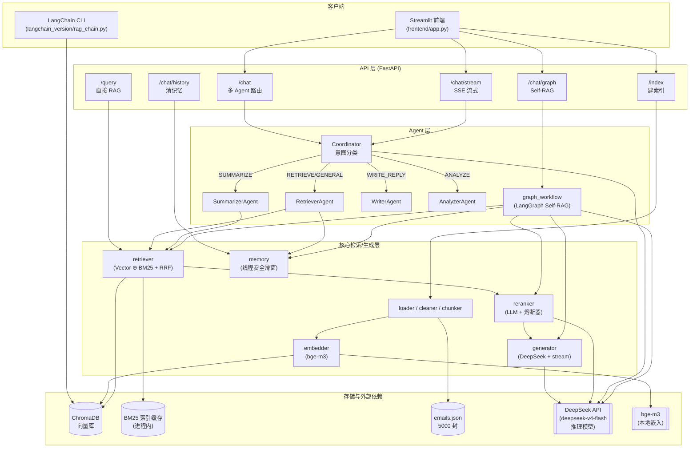
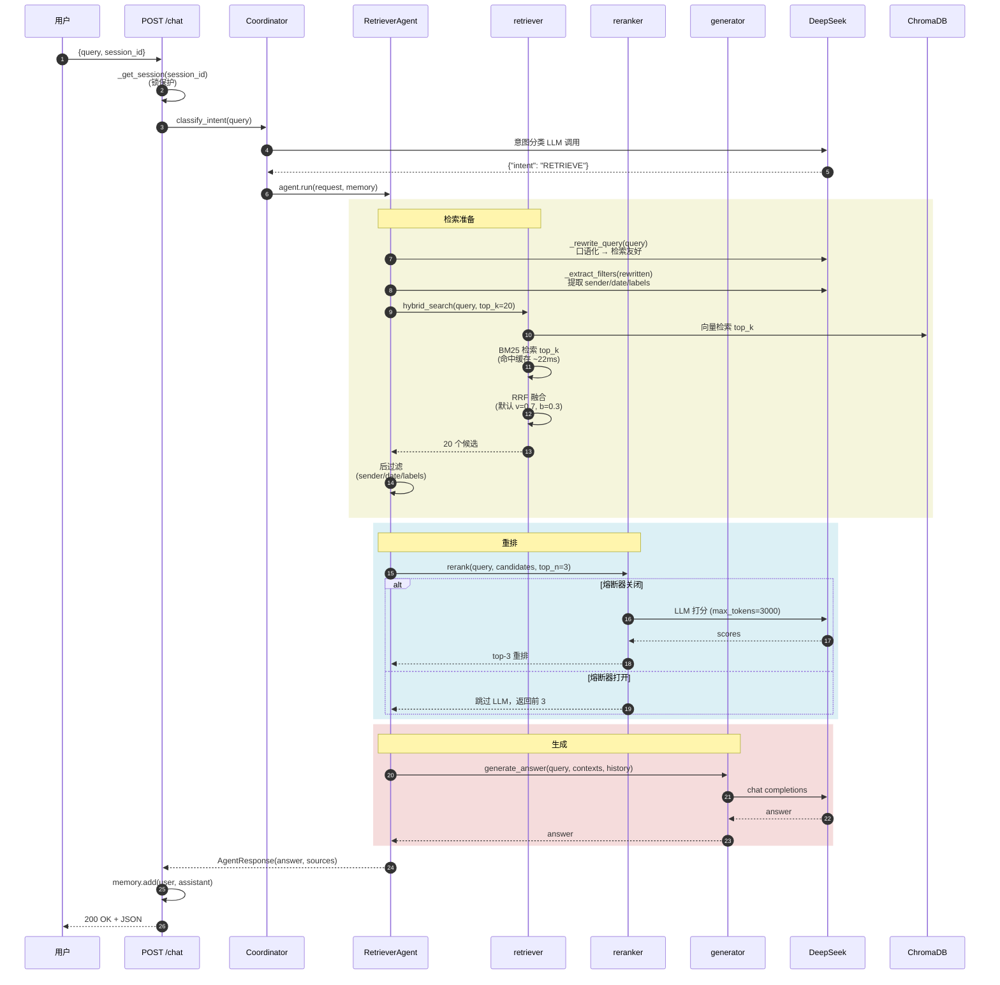
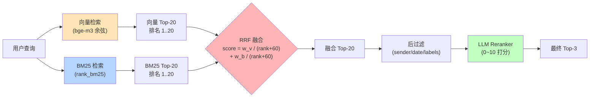
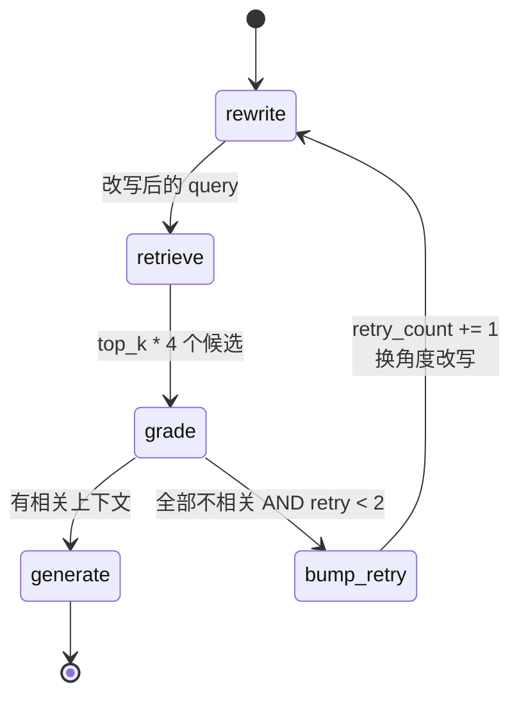
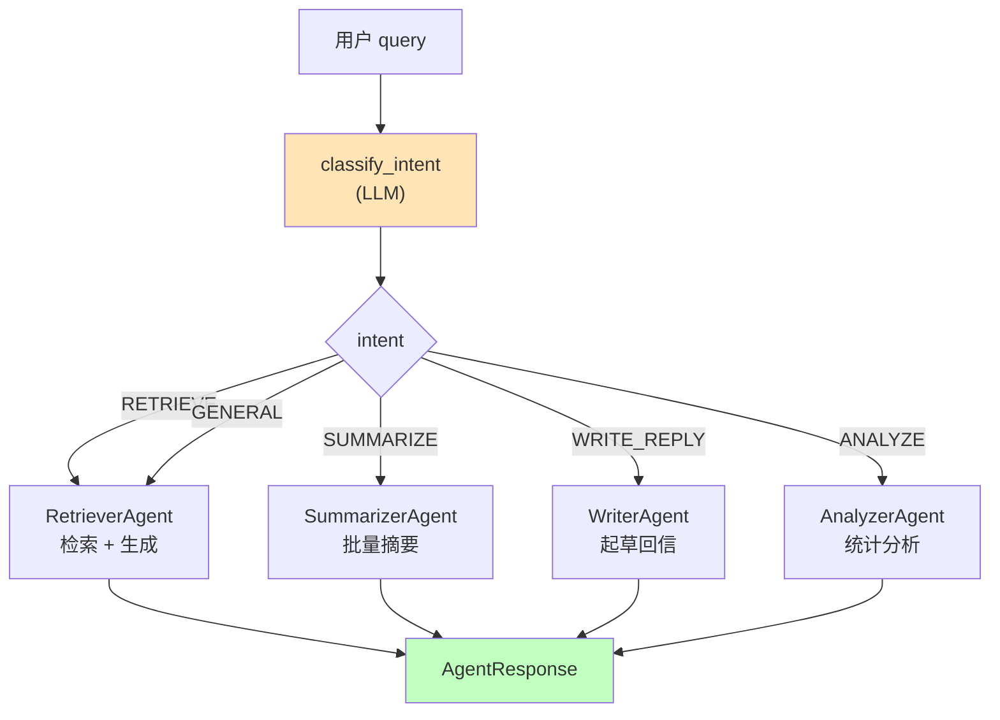
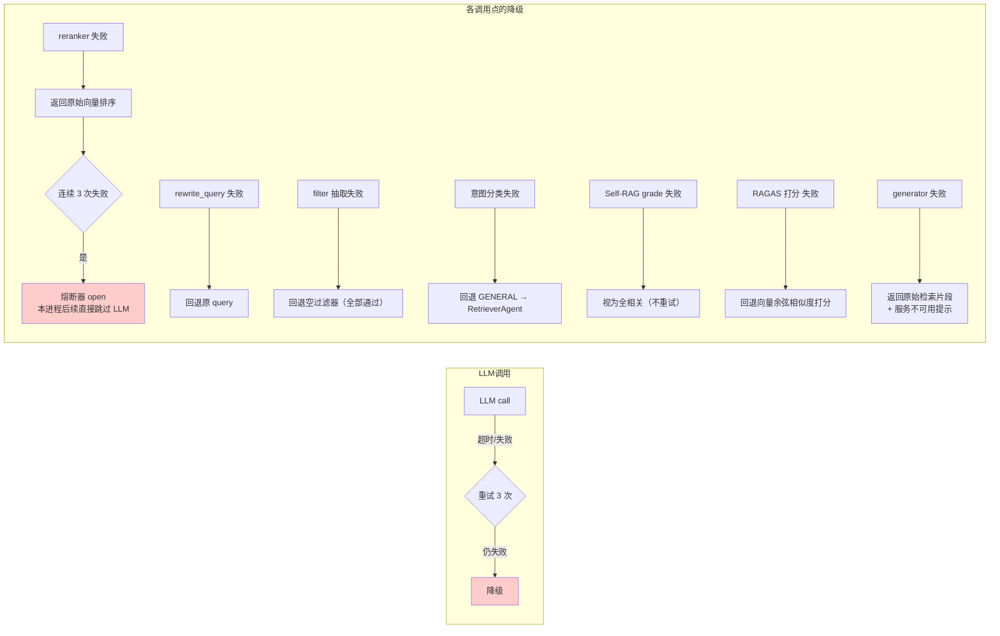
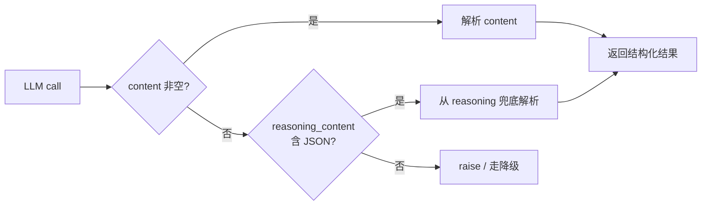

# 项目架构与流程

> 本文档用 Mermaid 图描述系统的组件关系和关键流程。在 VS Code（带 Markdown Preview Mermaid Support 插件）或 GitHub 上可直接渲染查看。

---

## 一、整体组件图



**分层说明**：

| 层 | 职责 | 关键设计 |
|---|---|---|
| API | HTTP 入口、SSE/WebSocket、降级 | 7 个端点，stateless（除 session_id 索引的内存对话） |
| Agent | 意图路由、按场景组合 core 能力 | 多 agent 模式，每个 agent 自治 |
| Core | 检索 / 生成 / 嵌入 / 切分 / 记忆 | 纯函数为主，可独立测试 |
| Storage | ChromaDB + 进程内 BM25 缓存 + 外部 LLM/embed | LLM 是外部依赖，要做超时和降级 |

---

## 二、离线索引流程

```mermaid
sequenceDiagram
    autonumber
    participant U as 用户
    participant API as POST /index
    participant L as core.loader
    participant C as core.cleaner
    participant CH as core.chunker
    participant E as core.embedder<br/>(bge-m3)
    participant DB as ChromaDB
    participant Cache as BM25 缓存

    U->>API: 触发索引
    API->>L: load_emails(emails.json)
    L-->>API: List[Email] (5000 封)
    loop 对每封邮件
        API->>C: clean_email(email)
        C-->>API: 去 HTML / 引用 / 签名
        API->>CH: chunk_email(cleaned)
        CH-->>API: List[EmailChunk]<br/>(滑窗 size=500, overlap=50)
    end
    API->>E: index_chunks(all_chunks)
    Note over E: bge-m3 batch 嵌入<br/>(batch_size=64)
    E->>DB: collection.add(<br/>ids, embeddings, metadatas, documents)
    DB-->>E: persisted
    E-->>API: count
    API->>Cache: invalidate_bm25_cache()<br/>(下次查询会重建)
    API-->>U: {"count": 5001}
```



**关键参数**（在 `.env` 配置）：
- `CHUNK_SIZE=500`，`CHUNK_OVERLAP=50`
- `EMBEDDING_MODEL=BAAI/bge-m3`
- 每封邮件平均切 ~1 个 chunk（短邮件不切），总计 ~5001 chunks

---

## 三、在线问答主链路（POST /chat）



**链路总耗时**：~30~50 秒（推理模型 5~10 秒/次 LLM 调用 × 4~5 次）。
**LLM 调用清单**：意图分类 → 改写 → 过滤抽取 → 重排打分 → 生成答案 = 5 次。
**真正的检索（向量 + BM25）只占 ~30ms**——瓶颈完全在 LLM。

---

## 四、混合检索 + RRF 融合细节



**为什么用 RRF 而不是分数加权**：BM25 分数和余弦相似度量纲完全不同（前者无上界、后者 0~1），直接加权会被量纲大的一方主导。RRF 只看排名，天然抗量纲。

`RRF_K=60` 是经验值（论文 Cormack et al. 2009），让靠前排名拉开差距、靠后排名钝化。

---

## 五、Self-RAG 工作流（POST /chat/graph）



**节点说明**：

| 节点 | 职责 |
|---|---|
| `rewrite` | LLM 改写 query（重试时用更高温度，换角度） |
| `retrieve` | hybrid_search + rerank |
| `grade` | LLM 判断每个 chunk 是否真的相关，返回相关索引列表 |
| `bump_retry` | 纯增量节点（`retry_count += 1`），让条件谓词 `_should_retry` 保持纯函数 |
| `generate` | 用相关 chunks 生成答案 |

**与普通 `/chat` 的区别**：多了 `grade_contexts` 这步。普通链路相信检索器给的 top-3 都有用；Self-RAG 不信，再让 LLM 过滤一道。如果 LLM 觉得全没用，就改写 query 重试（最多 2 次）。

**用 LangGraph 而不是手写循环的理由**：
- 节点 + 边的形式可序列化、可视化（上面这个状态机就是从代码反推画的）
- 条件边 `_should_retry` 是纯函数，单测好写
- 接 checkpointer 可以做"重启接续"（langgraph 自带）

---

## 六、多 Agent 路由（Coordinator）



**意图判定示例**：

| 用户问 | 分类 | 路由到 |
|---|---|---|
| "Q3 预算评审会议是谁发的？" | RETRIEVE | RetrieverAgent |
| "这周的项目进展整理一下" | SUMMARIZE | SummarizerAgent |
| "帮我回 Bob 那封邮件" | WRITE_REPLY | WriterAgent |
| "本月每个发件人发了多少封？" | ANALYZE | AnalyzerAgent |
| "那是什么意思？" | GENERAL | RetrieverAgent（兜底） |

`/chat/stream` 也走 Coordinator，但只有 RETRIEVE/GENERAL 走真流式（用 `stream_generate`），其他 agent 一次性返回（因为目前没 expose 流式接口）。

---

## 七、SSE 流式输出的线程桥接

```mermaid
sequenceDiagram
    participant Client as 浏览器 (EventSource)
    participant Loop as asyncio 事件循环
    participant Q as asyncio.Queue
    participant Worker as 工作线程<br/>(producer)
    participant DS as DeepSeek

    Client->>Loop: POST /chat/stream
    Loop->>Worker: run_in_executor(producer)
    Loop->>Q: await queue.get()  阻塞等

    Worker->>DS: stream=True<br/>chat.completions.create
    activate Worker
    DS-->>Worker: chunk 1
    Worker->>Loop: call_soon_threadsafe(<br/>queue.put_nowait, "你好")
    Loop->>Q: 入队
    Q-->>Loop: 唤醒 await
    Loop-->>Client: data: {"token":"你好"}\n\n

    DS-->>Worker: chunk 2
    Worker->>Loop: call_soon_threadsafe(...)
    Loop-->>Client: data: {"token":"，"}\n\n

    DS-->>Worker: chunk N (last)
    Worker->>Loop: put SENTINEL
    deactivate Worker

    Loop-->>Client: data: [DONE]\n\n
    Loop->>Loop: memory.add(user/assistant)
```

**关键点**：
- `stream_generate` 是同步生成器（OpenAI SDK 限制），跑在 worker 线程
- asyncio.Queue 跨线程通信靠 `call_soon_threadsafe`（这是 asyncio 唯一的跨线程安全 API）
- 事件循环线程不会阻塞，可以处理其他请求
- 修复前用的是 `list(stream_generate(...))`——把所有 token 收完才返回，等于假流式

---

## 八、降级策略全景



**降级原则**：
1. **永远不让用户看到 500**——再差也要返回检索片段或友好提示
2. **降级路径用业务可解释的方式**——比如打分 LLM 挂了用向量相似度顶上，分数不太准但单调性还在
3. **熔断器只在 reranker 用**——它是"锦上添花"层，挂了影响小；其他层挂了会让链路断，所以不熔断只重试

---

## 九、推理模型集成的特殊处理

DeepSeek `deepseek-v4-flash` 是**推理模型**，每次调用先输出 `reasoning_content`（思考链）再输出 `content`（最终答案）。所有 LLM 调用点都按这个特性适配：



具体处理：
- 普通调用 `max_tokens=1500`（够 reasoning + 短结构化输出）
- 高推理量调用（reranker、三维度评分）`max_tokens=3000`
- 所有结构化输出（JSON / 数组）调用都加 `reasoning_content` 兜底解析
- 所有调用都加 `timeout=cfg.LLM_TIMEOUT`（默认 60s，因为推理慢）

详见 `docs/engineering_pitfalls.md` 第一节。

---

## 十、目录结构

```
E:/智能邮件agent/
├── api/main.py                   # FastAPI 入口，7 个端点
├── frontend/app.py               # Streamlit 前端
├── agents/
│   ├── coordinator.py            # 意图分类 + 路由
│   ├── retriever_agent.py        # 检索 agent（含 prepare_contexts 公开方法）
│   ├── summarizer_agent.py       # 摘要 agent
│   ├── writer_agent.py           # 写信 agent
│   ├── analyzer_agent.py         # 分析 agent
│   └── graph_workflow.py         # LangGraph Self-RAG
├── core/
│   ├── loader.py                 # 邮件加载
│   ├── cleaner.py                # 清洗（去 HTML/引用/签名）
│   ├── chunker.py                # 切分（滑窗）
│   ├── embedder.py               # bge-m3 嵌入 + ChromaDB 读写
│   ├── retriever.py              # Vector + BM25 + RRF（带缓存）
│   ├── reranker.py               # LLM 重排（带熔断器）
│   ├── generator.py              # 答案生成（含流式）
│   └── memory.py                 # 多轮对话滑窗（线程安全）
├── config/settings.py            # 配置 + .env 加载
├── models/schemas.py             # Pydantic schemas + IntentType 枚举
├── scripts/
│   ├── generate_emails.py        # LLM 生成 5000 封测试邮件
│   ├── generate_ragas_data.py    # 生成 RAGAS 测试集
│   ├── run_ragas_eval.py         # 6 版本消融评测
│   └── debug_*.py                # 诊断 probe
├── langchain_version/rag_chain.py # LangChain 平行实现
├── chroma_db/                    # ChromaDB 持久化
├── data/
│   ├── emails.json
│   ├── ragas_testset.json
│   └── eval_results/
├── docs/
│   ├── architecture.md             # 本文
│   ├── evaluation.md               # RAGAS 6 版评测 + 业务选型
│   ├── technical_retrospective.md  # 5 个工程问题复盘
│   └── engineering_pitfalls.md     # 完整问题清单 + 调试方法论
├── Dockerfile + docker-compose.yml
└── .env (gitignored)
```
