# 项目架构与流程

> 本文档用 Mermaid 图描述系统的组件关系和关键流程。在 VS Code（带 Markdown Preview Mermaid Support 插件）或 GitHub 上可直接渲染查看。

---

## 一、整体组件图

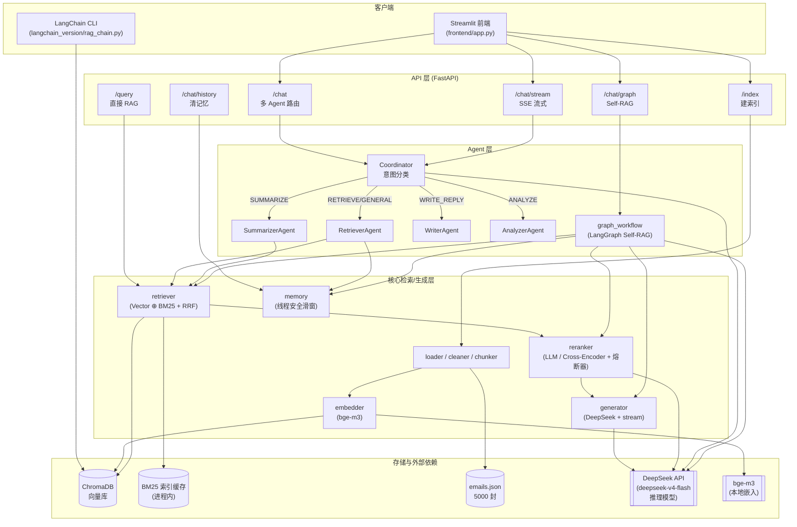
```mermaid
flowchart TB
    subgraph Client["客户端"]
        UI["Streamlit 前端<br/>(frontend/app.py)"]
        CLI["LangChain CLI<br/>(langchain_version/rag_chain.py)"]
    end

    subgraph API["API 层 (FastAPI)"]
        EP_INDEX["/index<br/>建索引"]
        EP_CHAT["/chat<br/>多 Agent 路由"]
        EP_STREAM["/chat/stream<br/>SSE 流式"]
        EP_GRAPH["/chat/graph<br/>Self-RAG"]
        EP_QUERY["/query<br/>直接 RAG"]
        EP_HIST["/chat/history<br/>清记忆"]
    end

    subgraph Agents["Agent 层"]
        COORD["Coordinator<br/>意图分类"]
        RA["RetrieverAgent"]
        SA["SummarizerAgent"]
        WA["WriterAgent"]
        AA["AnalyzerAgent"]
        GW["graph_workflow<br/>(LangGraph Self-RAG)"]
    end

    subgraph Core["核心检索/生成层"]
        LOAD["loader / cleaner / chunker"]
        EMB["embedder<br/>(bge-m3)"]
        RET["retriever<br/>(Vector ⊕ BM25 + RRF)"]
        RR["reranker<br/>(LLM / Cross-Encoder + 熔断器)"]
        GEN["generator<br/>(DeepSeek + stream)"]
        MEM["memory<br/>(线程安全滑窗)"]
    end

    subgraph Storage["存储与外部依赖"]
        CHROMA[(ChromaDB<br/>向量库)]
        BM25CACHE[("BM25 索引缓存<br/>(进程内)")]
        EMAILS[(emails.json<br/>5000 封)]
        DEEPSEEK[["DeepSeek API<br/>(deepseek-v4-flash<br/>推理模型)"]]
        BGE[["bge-m3<br/>(本地嵌入)"]]
    end

    UI --> EP_CHAT
    UI --> EP_STREAM
    UI --> EP_GRAPH
    UI --> EP_INDEX
    CLI --> CHROMA

    EP_INDEX --> LOAD --> EMB --> CHROMA
    EP_CHAT --> COORD
    EP_STREAM --> COORD
    EP_GRAPH --> GW
    EP_QUERY --> RET
    EP_HIST --> MEM

    COORD -->|RETRIEVE/GENERAL| RA
    COORD -->|SUMMARIZE| SA
    COORD -->|WRITE_REPLY| WA
    COORD -->|ANALYZE| AA

    RA --> RET --> RR --> GEN
    SA --> RET
    GW --> RET
    GW --> RR
    GW --> GEN

    RA --> MEM
    GW --> MEM

    RET --> CHROMA
    RET --> BM25CACHE
    EMB --> BGE
    GEN --> DEEPSEEK
    RR --> DEEPSEEK
    COORD --> DEEPSEEK
    GW --> DEEPSEEK

    LOAD --> EMAILS
```

**分层说明**：

| 层 | 职责 | 关键设计 |
|---|---|---|
| API | HTTP 入口、SSE/WebSocket、降级 | 7 个端点，stateless（除 session_id 索引的内存对话） |
| Agent | 意图路由、按场景组合 core 能力 | 多 agent 模式，每个 agent 自治 |
| Core | 检索 / 生成 / 嵌入 / 切分 / 记忆 | 纯函数为主，可独立测试 |
| Storage | ChromaDB + 进程内 BM25 缓存 + 外部 LLM/embed | LLM 是外部依赖，要做超时和降级 |

---

## 二、离线索引流程

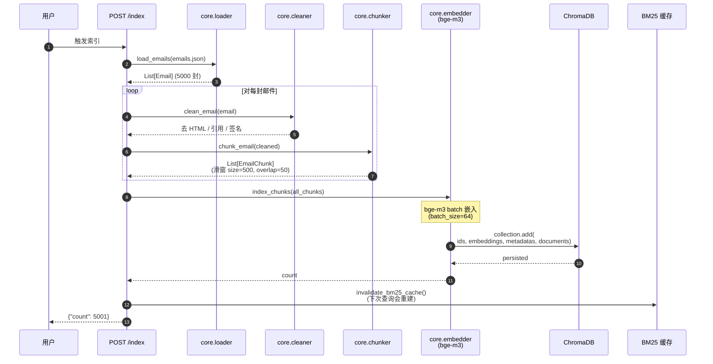
```mermaid
sequenceDiagram
    autonumber
    participant U as 用户
    participant API as POST /index
    participant L as core.loader
    participant C as core.cleaner
    participant CH as core.chunker
    participant E as core.embedder<br/>(bge-m3)
    participant DB as ChromaDB
    participant Cache as BM25 缓存

    U->>API: 触发索引
    API->>L: load_emails(emails.json)
    L-->>API: List[Email] (5000 封)
    loop 对每封邮件
        API->>C: clean_email(email)
        C-->>API: 去 HTML / 引用 / 签名
        API->>CH: chunk_email(cleaned)
        CH-->>API: List[EmailChunk]<br/>(滑窗 size=500, overlap=50)
    end
    API->>E: index_chunks(all_chunks)
    Note over E: bge-m3 batch 嵌入<br/>(batch_size=64)
    E->>DB: collection.add(<br/>ids, embeddings, metadatas, documents)
    DB-->>E: persisted
    E-->>API: count
    API->>Cache: invalidate_bm25_cache()<br/>(下次查询会重建)
    API-->>U: {"count": 5001}
```

**关键参数**（在 `.env` 配置）：
- `CHUNK_SIZE=500`，`CHUNK_OVERLAP=50`
- `EMBEDDING_MODEL=BAAI/bge-m3`
- 每封邮件平均切 ~1 个 chunk（短邮件不切），总计 ~5001 chunks

---

## 三、在线问答主链路（POST /chat）

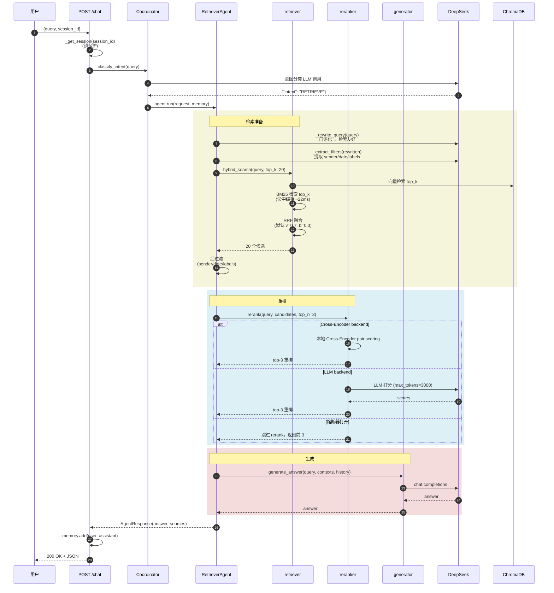
```mermaid
sequenceDiagram
    autonumber
    participant U as 用户
    participant API as POST /chat
    participant Co as Coordinator
    participant RA as RetrieverAgent
    participant Ret as retriever
    participant RR as reranker
    participant Gen as generator
    participant DS as DeepSeek
    participant DB as ChromaDB

    U->>API: {query, session_id}
    API->>API: _get_session(session_id)<br/>(锁保护)
    API->>Co: classify_intent(query)
    Co->>DS: 意图分类 LLM 调用
    DS-->>Co: {"intent": "RETRIEVE"}
    Co->>RA: agent.run(request, memory)

    rect rgb(245, 245, 220)
    Note over RA,Ret: 检索准备
    RA->>DS: _rewrite_query(query)<br/>口语化 → 检索友好
    RA->>DS: _extract_filters(rewritten)<br/>提取 sender/date/labels
    RA->>Ret: hybrid_search(query, top_k=20)
    Ret->>DB: 向量检索 top_k
    Ret->>Ret: BM25 检索 top_k<br/>(命中缓存 ~22ms)
    Ret->>Ret: RRF 融合<br/>(默认 v=0.7, b=0.3)
    Ret-->>RA: 20 个候选
    RA->>RA: 后过滤<br/>(sender/date/labels)
    end

    rect rgb(220, 240, 245)
    Note over RA,RR: 重排
    RA->>RR: rerank(query, candidates, top_n=3)
    alt Cross-Encoder backend
        RR->>RR: 本地 Cross-Encoder pair scoring
        RR-->>RA: top-3 重排
    else LLM backend
        RR->>DS: LLM 打分 (max_tokens=3000)
        DS-->>RR: scores
        RR-->>RA: top-3 重排
    else 熔断器打开
        RR-->>RA: 跳过 rerank，返回前 3
    end
    end

    rect rgb(245, 220, 220)
    Note over RA,Gen: 生成
    RA->>Gen: generate_answer(query, contexts, history)
    Gen->>DS: chat completions
    DS-->>Gen: answer
    Gen-->>RA: answer
    end

    RA-->>API: AgentResponse(answer, sources)
    API->>API: memory.add(user, assistant)
    API-->>U: 200 OK + JSON
```

**链路总耗时**：默认 V2 配置约 8.7s（mean）/ 14.4s（p95）；全开 V4 配置约 24s；V7 把重排从额外 LLM 调用切到本地 Cross-Encoder。Phase 8 新增 `scripts/measure_reranker_latency.py` 隔离测 rerank step，并用 `core.reranker_policy` 固化 V2/V3/V7 的 serving 取舍。
**LLM 调用清单**：意图分类 → 改写 → 过滤抽取 → 生成答案 = 常规最多 4 次；只有 LLM reranker backend 才会额外增加一次重排打分。
**真正的检索（向量 + BM25）只占 ~30ms**——瓶颈在 LLM 调用次数，详见 [`docs/evaluation.md`](evaluation.md)。

---

## 四、混合检索 + RRF 融合细节

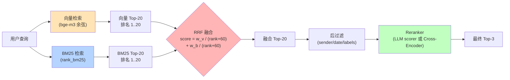
```mermaid
flowchart LR
    Q["用户查询"] --> V["向量检索<br/>(bge-m3 余弦)"]
    Q --> B["BM25 检索<br/>(rank_bm25)"]

    V --> V20["向量 Top-20<br/>排名 1..20"]
    B --> B20["BM25 Top-20<br/>排名 1..20"]

    V20 --> RRF{"RRF 融合<br/>score = w_v / (rank+60)<br/> + w_b / (rank+60)"}
    B20 --> RRF

    RRF --> M20["融合 Top-20"]
    M20 --> F["后过滤<br/>(sender/date/labels)"]
    F --> R["Reranker<br/>(LLM scorer 或 Cross-Encoder)"]
    R --> T3["最终 Top-3"]

    style V fill:#ffe4b5
    style B fill:#b5d4ff
    style RRF fill:#ffb5b5
    style R fill:#c0ffc0
```

**为什么用 RRF 而不是分数加权**：BM25 分数和余弦相似度量纲完全不同（前者无上界、后者 0~1），直接加权会被量纲大的一方主导。RRF 只看排名，天然抗量纲。

`RRF_K=60` 是经验值（论文 Cormack et al. 2009），让靠前排名拉开差距、靠后排名钝化。

---

## 五、Self-RAG 工作流（POST /chat/graph）

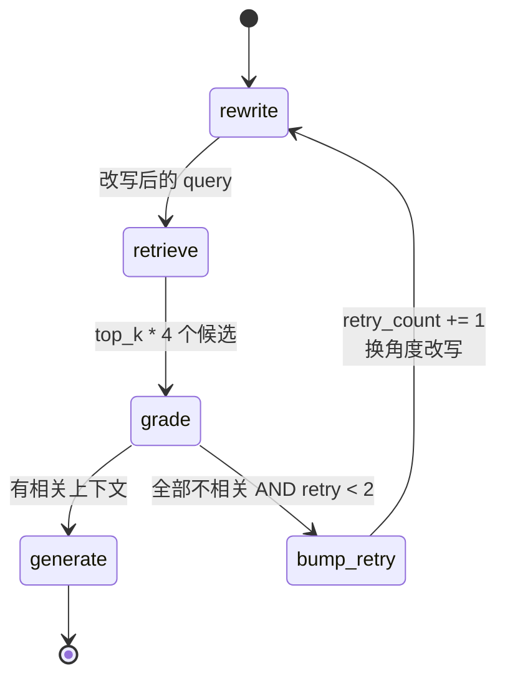
```mermaid
stateDiagram-v2
    [*] --> rewrite
    rewrite --> retrieve: 改写后的 query
    retrieve --> grade: top_k * 4 个候选
    grade --> generate: 有相关上下文
    grade --> bump_retry: 全部不相关 AND retry < 2
    bump_retry --> rewrite: retry_count += 1<br/>换角度改写
    generate --> [*]
```

**节点说明**：

| 节点 | 职责 |
|---|---|
| `rewrite` | LLM 改写 query（重试时用更高温度，换角度） |
| `retrieve` | hybrid_search + rerank |
| `grade` | LLM 判断每个 chunk 是否真的相关，返回相关索引列表 |
| `bump_retry` | 纯增量节点（`retry_count += 1`），让条件谓词 `_should_retry` 保持纯函数 |
| `generate` | 用相关 chunks 生成答案 |

**与普通 `/chat` 的区别**：多了 `grade_contexts` 这步。普通链路相信检索器给的 top-3 都有用；Self-RAG 不信，再让 LLM 过滤一道。如果 LLM 觉得全没用，就改写 query 重试（最多 2 次）。

**用 LangGraph 而不是手写循环的理由**：
- 节点 + 边的形式可序列化、可视化（上面这个状态机就是从代码反推画的）
- 条件边 `_should_retry` 是纯函数，单测好写
- 接 checkpointer 可以做"重启接续"（langgraph 自带）

---

## 六、多 Agent 路由（Coordinator）

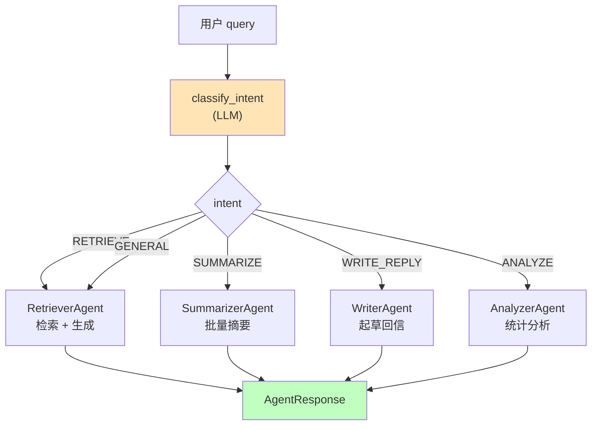
```mermaid
flowchart TD
    Q["用户 query"] --> CLS["classify_intent<br/>(LLM)"]
    CLS --> SW{intent}

    SW -->|RETRIEVE| RA["RetrieverAgent<br/>检索 + 生成"]
    SW -->|GENERAL| RA
    SW -->|SUMMARIZE| SA["SummarizerAgent<br/>批量摘要"]
    SW -->|WRITE_REPLY| WA["WriterAgent<br/>起草回信"]
    SW -->|ANALYZE| AA["AnalyzerAgent<br/>统计分析"]

    RA --> RES["AgentResponse"]
    SA --> RES
    WA --> RES
    AA --> RES

    style CLS fill:#ffe4b5
    style RES fill:#c0ffc0
```

**意图判定示例**：

| 用户问 | 分类 | 路由到 |
|---|---|---|
| "Q3 预算评审会议是谁发的？" | RETRIEVE | RetrieverAgent |
| "这周的项目进展整理一下" | SUMMARIZE | SummarizerAgent |
| "帮我回 Bob 那封邮件" | WRITE_REPLY | WriterAgent |
| "本月每个发件人发了多少封？" | ANALYZE | AnalyzerAgent |
| "那是什么意思？" | GENERAL | RetrieverAgent（兜底） |

`/chat/stream` 也走 Coordinator，但只有 RETRIEVE/GENERAL 走真流式（用 `stream_generate`），其他 agent 一次性返回（因为目前没 expose 流式接口）。

---

## 七、SSE 流式输出的线程桥接

```mermaid
sequenceDiagram
    participant Client as 浏览器 (EventSource)
    participant Loop as asyncio 事件循环
    participant Q as asyncio.Queue
    participant Worker as 工作线程<br/>(producer)
    participant DS as DeepSeek

    Client->>Loop: POST /chat/stream
    Loop->>Worker: run_in_executor(producer)
    Loop->>Q: await queue.get()  阻塞等

    Worker->>DS: stream=True<br/>chat.completions.create
    activate Worker
    DS-->>Worker: chunk 1
    Worker->>Loop: call_soon_threadsafe(<br/>queue.put_nowait, "你好")
    Loop->>Q: 入队
    Q-->>Loop: 唤醒 await
    Loop-->>Client: data: {"token":"你好"}\n\n

    DS-->>Worker: chunk 2
    Worker->>Loop: call_soon_threadsafe(...)
    Loop-->>Client: data: {"token":"，"}\n\n

    DS-->>Worker: chunk N (last)
    Worker->>Loop: put SENTINEL
    deactivate Worker

    Loop-->>Client: data: [DONE]\n\n
    Loop->>Loop: memory.add(user/assistant)
```

**关键点**：
- `stream_generate` 是同步生成器（OpenAI SDK 限制），跑在 worker 线程
- asyncio.Queue 跨线程通信靠 `call_soon_threadsafe`（这是 asyncio 唯一的跨线程安全 API）
- 事件循环线程不会阻塞，可以处理其他请求
- 修复前用的是 `list(stream_generate(...))`——把所有 token 收完才返回，等于假流式

---

## 八、降级策略全景

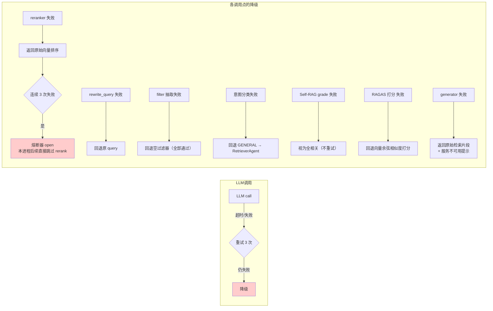
```mermaid
flowchart LR
    subgraph LLM调用
        L1["LLM call"] -->|超时/失败| L2{重试 3 次}
        L2 -->|仍失败| L3["降级"]
    end

    subgraph 各调用点的降级
        Rerank["reranker 失败"] --> R1["返回原始向量排序"]
        R1 --> R2{连续 3 次失败}
        R2 -->|是| R3["熔断器 open<br/>本进程后续直接跳过 rerank"]

        Rewrite["rewrite_query 失败"] --> RW1["回退原 query"]
        Filter["filter 抽取失败"] --> F1["回退空过滤器（全部通过）"]
        Intent["意图分类失败"] --> I1["回退 GENERAL → RetrieverAgent"]
        Grade["Self-RAG grade 失败"] --> G1["视为全相关（不重试）"]
        Score["RAGAS 打分 失败"] --> S1["回退向量余弦相似度打分"]
        Gen["generator 失败"] --> GN1["返回原始检索片段<br/>+ 服务不可用提示"]
    end

    style L3 fill:#ffcccc
    style R3 fill:#ffcccc
```

**降级原则**：
1. **永远不让用户看到 500**——再差也要返回检索片段或友好提示
2. **降级路径用业务可解释的方式**——比如打分 LLM 挂了用向量相似度顶上，分数不太准但单调性还在
3. **熔断器只在 reranker 用**——它是"锦上添花"层，挂了影响小；其他层挂了会让链路断，所以不熔断只重试

---

## 九、推理模型集成的特殊处理

DeepSeek `deepseek-v4-flash` 是**推理模型**，每次调用先输出 `reasoning_content`（思考链）再输出 `content`（最终答案）。所有 LLM 调用点都按这个特性适配：

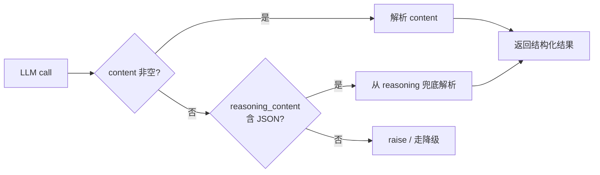
```mermaid
flowchart LR
    A["LLM call"] --> B{"content 非空?"}
    B -->|是| C["解析 content"]
    B -->|否| D{"reasoning_content<br/>含 JSON?"}
    D -->|是| E["从 reasoning 兜底解析"]
    D -->|否| F["raise / 走降级"]
    C --> G["返回结构化结果"]
    E --> G
```

具体处理：
- 普通调用 `max_tokens=1500`（够 reasoning + 短结构化输出）
- 高推理量调用（LLM reranker、三维度评分）`max_tokens=3000`
- 所有结构化输出（JSON / 数组）调用都加 `reasoning_content` 兜底解析
- 所有调用都加 `timeout=cfg.LLM_TIMEOUT`（默认 60s，留足余量）

详见 `docs/engineering_pitfalls.md` 第一节。

---

## 十、Agent 工具调用循环（POST /chat/agent）

在 §六 固定意图路由之外，`/chat/agent` 提供一条 function-calling 的 agent 链路：
规划模型自主决定调用哪些工具、调几轮，可完成多步任务。

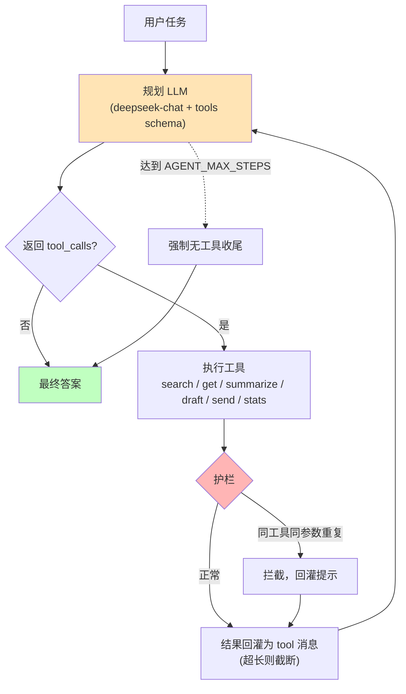
```mermaid
flowchart TD
    Q["用户任务"] --> LLM["规划 LLM<br/>(deepseek-chat + tools schema)"]
    LLM --> D{"返回 tool_calls?"}
    D -->|否| ANS["最终答案"]
    D -->|是| EXEC["执行工具<br/>search / get / summarize / draft / send / stats"]
    EXEC --> GUARD{"护栏"}
    GUARD -->|"同工具同参数重复"| BLOCK["拦截，回灌提示"]
    GUARD -->|正常| FEED["结果回灌为 tool 消息<br/>(超长则截断)"]
    BLOCK --> FEED
    FEED --> LLM
    LLM -.->|"达到 AGENT_MAX_STEPS"| FORCE["强制无工具收尾"]
    FORCE --> ANS

    style LLM fill:#ffe4b5
    style ANS fill:#c0ffc0
    style GUARD fill:#ffb5b5
```

工具 schema 不再直接手写在 loop 里，而是来自 `agents/tool_registry.py`：

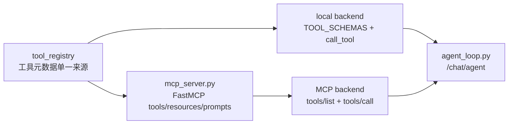
```mermaid
flowchart LR
    Registry["tool_registry<br/>工具元数据单一来源"]
    Local["local backend<br/>TOOL_SCHEMAS + call_tool"]
    MCPServer["mcp_server.py<br/>FastMCP tools/resources/prompts"]
    MCPClient["MCP backend<br/>tools/list + tools/call"]
    Loop["agent_loop.py<br/>/chat/agent"]

    Registry --> Local
    Registry --> MCPServer
    Local --> Loop
    MCPServer --> MCPClient --> Loop
```

默认 `AGENT_TOOL_BACKEND=local`，所以现有 `/chat/agent` 仍然走进程内
function-calling 工具层；设置 `AGENT_TOOL_BACKEND=mcp` 后，`agents/mcp_adapter.py`
会从 `MCP_SERVER_URL` 拉取 MCP tools，再转换成 OpenAI-compatible `tools` schema
交给规划模型。模型返回 tool call 后，后端通过 MCP `tools/call` 执行工具。

**6 个工具**（`agents/tools.py`）：

| 工具 | 风险级别 | 是否人审 | 作用 |
|---|---|---:|---|
| `search_emails` | low | 否 | 混合检索（向量+BM25+RRF），可带 sender/date/labels 过滤 |
| `get_email` | low | 否 | 按 email_id 取整封邮件 |
| `summarize_emails` | low | 否 | 检索 + 结构化摘要 |
| `draft_reply` | medium | 否 | 起草回信，支持 email_id 精确定位（多步任务用） |
| `send_email` | high | 是 | 只创建 pending approval；审批后 simulated 或 Gmail draft-only |
| `email_stats` | low | 否 | 发件人 / 标签 / 每日量聚合统计 |

同一批能力也由 `mcp_server.py` 暴露为：

| MCP 能力 | 内容 |
|---|---|
| Tools | 上表 6 个工具 |
| Resources | `email://{email_id}`、`email-corpus://stats` |
| Prompts | `draft_reply_prompt`、`summarize_emails_prompt` |

MCP backend 已加入生产化基础：

| 能力 | 代码 | 说明 |
|---|---|---|
| Bearer token | `mcp_server.StaticBearerTokenVerifier` / `StreamableHttpMCPClient.headers()` | `MCP_AUTH_TOKEN` 非空时 client 带 `Authorization: Bearer ...`，server 注入 token verifier |
| Schema cache | `MCPToolBackend.tool_schemas()` | 缓存 `tools/list` 结果，避免每轮 planner 重复发现工具 |
| Audit JSONL | `MCPAuditLogger` | 记录 tool、status、latency、request_id 到 `MCP_AUDIT_LOG_PATH` |
| Tool policy | `agents/tool_policy.py` | 支持 `MCP_ALLOWED_TOOLS` 白名单和 `MCP_READ_ONLY_MODE` 只读暴露策略 |
| Audit query API | `GET /agent/mcp-audit` | 按 tool/status/limit 查询 MCP 工具调用审计事件 |
| 工具风险元数据 | `ToolSpec.risk_level` / `requires_approval` | 高风险工具可被人审链路拦住 |

**护栏**（`AGENT_*` 配置，详见 `agents/agent_loop.py`）：

| 护栏 | 机制 |
|---|---|
| 步数上限 | `AGENT_MAX_STEPS`（默认 6），超限强制无工具收尾 |
| 死循环检测 | 同工具 + 同参数调用超过 `AGENT_MAX_REPEAT`（默认 2）次即拦截 |
| 参数校验 | 丢弃模型幻觉的多余 kwarg，缺失必填参数回灌错误 |
| 工具报错回灌 | 工具异常被捕获转成 error 结果，不让 loop 崩 |
| 输出截断 | 单次工具结果超 `AGENT_TOOL_OUTPUT_LIMIT` 截断，防上下文膨胀 |
| 高风险动作人审 | `send_email` 只创建 `pending_approval`，由 `/agent/approvals/*` 人工确认 |

**Human-in-the-loop**：

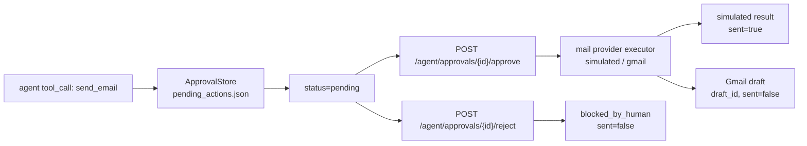
```mermaid
flowchart LR
    Agent["agent tool_call: send_email"] --> Store["ApprovalStore<br/>pending_actions.json"]
    Store --> Pending["status=pending"]
    Pending --> Approve["POST /agent/approvals/{id}/approve"]
    Pending --> Reject["POST /agent/approvals/{id}/reject"]
    Approve --> Provider["mail provider executor<br/>simulated / gmail"]
    Provider --> Sim["simulated result<br/>sent=true"]
    Provider --> Gmail["Gmail draft<br/>draft_id, sent=false"]
Reject --> Block["blocked_by_human<br/>sent=false"]
```

**Gmail read-only ingestion（Phase 9）**：

`agents/gmail_readonly.py` 使用独立 `GMAIL_READONLY_SCOPES=https://www.googleapis.com/auth/gmail.readonly`，只读取邮件，不复用 draft-only compose scope。`scripts/sync_gmail_readonly.py` 将 Gmail `messages.list/get` 结果解析成现有 `Email` schema，写入本地忽略目录 `data/real_emails/`，并用 `data/mail_sync/gmail_sync_state.json` 的 `seen_message_ids` 做增量去重。加 `--index` 时继续复用 cleaner、chunker、embedder 和 BM25 cache invalidation。

**Agent trace + EvalOps**：

`agents/tracing.py` 在 `ENABLE_AGENT_TRACE=true` 时写 JSONL，记录 `agent_start`、
`tool_call`、`agent_end`。`scripts/summarize_agent_traces.py` 可汇总 runs、tool_calls、
tool_errors、approval_required、avg_tool_latency_ms。`scripts/run_agent_eval.py` 会把
`trace_id` 写入每条评测记录，方便从 eval case 反查真实工具轨迹。

`agents/evalops.py` 把 trace 和 eval record 连接起来：当前 105 条 agent 任务集每条都带
`task_type`、`risk_level`、`expected_tools`、`forbidden_tools`、`success_criteria`；
评测记录会生成 `failure_category`，区分 forbidden_tool、missing_expected_tool、
tool_error、approval_required、max_steps、judge_failed 等失败原因，并可输出
`agent_eval_report.md` 供面试或回归复盘。`scripts/check_agent_eval_gate.py`
可离线读取 `agent_eval.json`，按任务数、成功率、工具准确率、禁用工具违规率和
max_steps 触发率做阈值 gate。

**与 §六 固定路由的区别**：Coordinator 是"一次分类 → 一条固定链"；agent loop 是 LLM
自主多轮规划，能把"找出 X 并逐封处理"这类任务拆成 `search → 逐个 draft` 的多步链。
旧的 `/chat`（固定路由）保留作为降级路径。

**评测**：`scripts/run_agent_eval.py` 用任务成功率 / 工具调用准确率 / 平均步数 /
禁用工具违规率评测 agent 本身（区别于 RAGAS 评测检索质量），结果见
`data/eval_results/agent_eval.json`，报告可写到
`data/eval_results/agent_eval_report.md`。

RAG 侧的版本评测由 `scripts/run_ragas_eval.py` 负责，端到端 latency 由
`scripts/measure_latency.py` 负责；Phase 8 新增 `scripts/measure_reranker_latency.py`
只测 rerank step，避免把 generation/API 抖动误归因给 Cross-Encoder。上线策略由
`core.reranker_policy.choose_reranker_policy()` 统一表达：默认对话/低延迟预算走 V2，
质量优先走 V7，高 precision 且显式允许额外 LLM scorer 时才把 V3 当对照。
Phase 10 新增 `scripts/evaluate_context_recall.py`，从 `gold_chunk_ids`
计算确定性 `context_recall`、chunk hit rate 和 perfect recall rate。当前 synthetic
gold baseline 已写入 `data/gold_chunks.json`，V2/V7 结果见
`data/eval_results/context_recall.json`（V7 `mean_context_recall=0.8000`）。

---

## 十一、目录结构

```
E:/智能邮件agent/
├── api/main.py                   # FastAPI 入口，含 chat / agent / approval 端点
├── frontend/app.py               # Streamlit 前端
├── mcp_server.py                 # MCP server（tools/resources/prompts）
├── agents/
│   ├── coordinator.py            # 意图分类 + 路由
│   ├── retriever_agent.py        # 检索 agent（含 prepare_contexts 公开方法）
│   ├── summarizer_agent.py       # 摘要 agent
│   ├── writer_agent.py           # 写信 agent
│   ├── analyzer_agent.py         # 分析 agent
│   ├── graph_workflow.py         # LangGraph Self-RAG
│   ├── tool_registry.py          # 工具元数据单一来源
│   ├── tool_policy.py            # MCP 工具可见性策略
│   ├── evalops.py                # Agent eval 失败归因和报告生成
│   ├── mcp_adapter.py            # MCP tools/list → function schema，tools/call → tool result + audit/cache
│   ├── approvals.py              # Human-in-the-loop 审批存储
│   ├── mail_providers.py          # simulated / Gmail draft-only 审批执行 provider
│   ├── gmail_readonly.py          # Gmail read-only 同步 provider + MIME 解析
│   ├── tracing.py                # Agent trace JSONL
│   ├── tools.py                  # Agent 工具层（6 工具 + schema + dispatch）
│   └── agent_loop.py             # function-calling agent 循环 + 护栏
├── core/
│   ├── loader.py                 # 邮件加载
│   ├── cleaner.py                # 清洗（去 HTML/引用/签名）
│   ├── chunker.py                # 切分（滑窗）
│   ├── embedder.py               # bge-m3 嵌入 + ChromaDB 读写
│   ├── retriever.py              # Vector + BM25 + RRF（带缓存）
│   ├── pipeline.py               # 统一检索链路 retrieve()（agent/eval 共用）
│   ├── reranker_policy.py        # V2/V3/V7 reranker serving policy
│   ├── reranker.py               # LLM / Cross-Encoder 重排（带熔断器）
│   ├── generator.py              # 答案生成（含上下文预算和流式）
│   └── memory.py                 # 多轮对话滑窗（线程安全）
├── config/settings.py            # 配置 + .env 加载
├── models/schemas.py             # Pydantic schemas + IntentType 枚举
├── scripts/
│   ├── generate_emails.py        # LLM 生成 5000 封测试邮件
│   ├── generate_ragas_data.py    # 生成 RAGAS 测试集
│   ├── run_ragas_eval.py         # 7 版本消融评测
│   ├── measure_latency.py        # 端到端 RAG latency benchmark
│   ├── measure_reranker_latency.py # rerank-only latency benchmark + policy output
│   ├── evaluate_context_recall.py # gold chunk 模板 + context_recall
│   ├── sync_gmail_readonly.py    # Gmail read-only 增量同步
│   ├── run_agent_eval.py         # Agent 任务评测 + EvalOps report
│   ├── check_agent_eval_gate.py   # Agent EvalOps 离线 gate
│   ├── summarize_agent_traces.py # Trace 汇总
│   └── debug_*.py                # 诊断 probe
├── langchain_version/rag_chain.py # LangChain 平行实现
├── chroma_db/                    # ChromaDB 持久化
├── data/
│   ├── emails.json
│   ├── ragas_testset.json
│   └── eval_results/
├── docs/
│   ├── architecture.md             # 本文
│   ├── evaluation.md               # RAGAS 7 版评测 + 业务选型
│   ├── technical_retrospective.md  # 工程问题复盘
│   └── engineering_pitfalls.md     # 完整问题清单 + 调试方法论
├── Dockerfile + docker-compose.yml
└── .env (gitignored)
```
