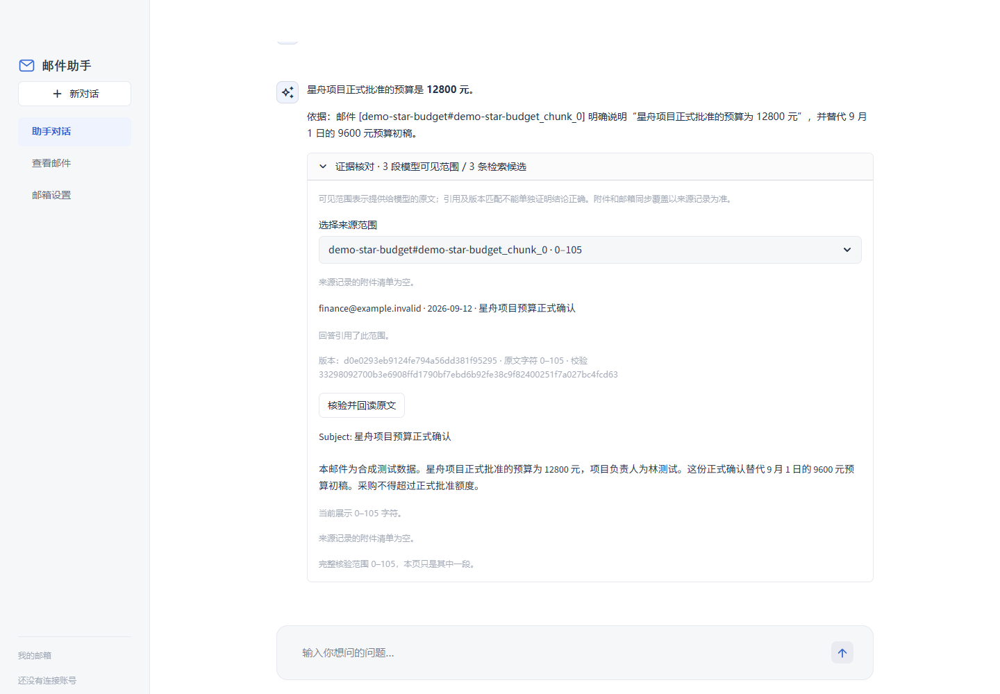

# 当前版本操作演示

[](demo.mp4)

**56.52 秒，约 2.50 MiB。** 录像来自本机实际运行的 Streamlit、FastAPI、bge-m3 和远端生成模型。浏览器自动化操作现有界面，没有生成或替换应用画面、邮件回答、工具结果。成片保留录制时序，仅转为 H.264，并在应用画面外增加“合成邮件 / 本地模拟审批 / 未发送”的页脚。

数据是仓库内的 [12 封合成邮件](../../../data/portfolio_demo/emails.json)。本次没有连接真实邮箱。`send_email` 在本项目中创建待审批请求；本片点击批准后只执行 simulated provider，不发送邮件，不创建 Gmail 远端草稿。

## 操作与验收

| 步骤 | 实际操作及结果 | 截图 |
|---|---|---|
| 导入资料 | 在“会话 → 高级选项 → 打开高级工具”中填写 `data/portfolio_demo/emails.json` | [导入](02-import.png) |
| 建立索引 | 点击“索引邮件”；后台任务 succeeded，12 封邮件、12 个片段，全部新编码 | [索引完成](03-indexed.png) |
| 普通问答 | 查询星舟正式预算；回答 12800 元并引用正式预算邮件 | [问答](04-answer.png) |
| 核验来源 | 展开证据，首次点击“核验并回读原文”即显示原文及完整核验范围 | [原文回读](05-evidence.png) |
| 起草回复 | 在会话高级选项中选择 Agent，读取会议邮件并起草确认参会回复 | [草稿及待审批](06-draft-pending.png) |
| 工具执行 | 实际依次调用 `get_email → draft_reply → send_email`，共 3 次；任务完成于待审批状态 | [工具步骤](07-tool-steps.png) |
| 审批前核对 | 在高级工作台打开“草稿审批与结果核对”，核对收件人、会议内容和本地模拟执行方式 | [审批前](08-approval-review.png) |
| 批准 | 操作“批准创建草稿”按钮；结果 `status=approved`、`provider=simulated`、`sent=false`、`simulated=true` | [审批后](09-approved-simulated.png) |

这里的 Agent 请求明确指定了读取、起草、创建审批的工具流程，属于流程验收，不是自由任务规划能力的独立评分。草稿中的 2026-09-18、上午 10 点、梧桐会议室和收件人均已对照合成来源核对。

## 可复现的操作

先按项目说明安装依赖、配置模型 API key，并准备嵌入模型缓存；此启动器不会自动下载模型。

```powershell
.\.venv\Scripts\python.exe scripts/run_portfolio_eval.py --demo --run-dir E:/email-agent-validation/my-demo
```

打开输出地址，按上表操作。问答输入：

> 星舟项目正式批准的预算是多少元？请引用邮件来源。

切换到 Agent 后输入：

> 这是合成邮件演示。请读取 demo-star-meeting，调用 draft_reply 起草确认参会的简短回复，写明会议日期、时间和地点；随后调用 send_email 为该回复建立待审批请求，收件人为 pm@example.invalid，主题为“回复：星舟项目评审会议安排”。我会在审批界面确认。不要直接发送邮件。

审批按钮在高级工作台，不在聊天首页的简化布局中。录像中的操作由浏览器自动化执行了这个确认步骤；模型本身没有批准自己的请求。

结束时在该运行目录新建 `STOP` 文件。目录必须全新、位于源码仓库外，Windows 上完整路径仅用 ASCII；全部索引、会话、任务和审批状态隔离在其中。默认端口为 18801 / 18802，必要时通过 `--api-port` 和 `--ui-port` 修改。调用生成模型可能计费。

## 证据与限制

- [浏览器事件](browser-events.json)：9 个录制节点、0 个未捕获页面错误。时间是自动化脚本的相对时间，不是视频精确逐帧时间码。
- [流程核对及原始任务/审批记录](demo-workflow.json)：11 条验收断言全部通过；这些是同一条演示流程的检查点，不是 11 个独立场景。
- [视频格式与哈希校验](video-verification.json)：H.264、1440×1064、完整解码检查通过；其中应用实际视口为 1440×1000，下方 64 像素为说明页脚。
- 原始 WebM 与录制过程中的失败尝试保留在 `E:/email-agent-validation/portfolio-20260914/`。一次失败定位并修复了来源按钮首击丢失；其他失败为自动化选择器对隐藏控件及界面重跑时序处理不当，已调整录制脚本。成片来自修复后一次完整成功流程。
- 本视频证明导入合成资料的这条流程可运行，不证明真实邮箱在线接入、自动发送、长期稳定性或多用户能力。
